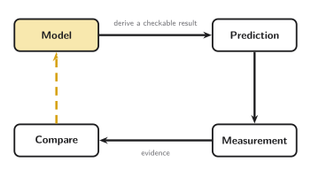
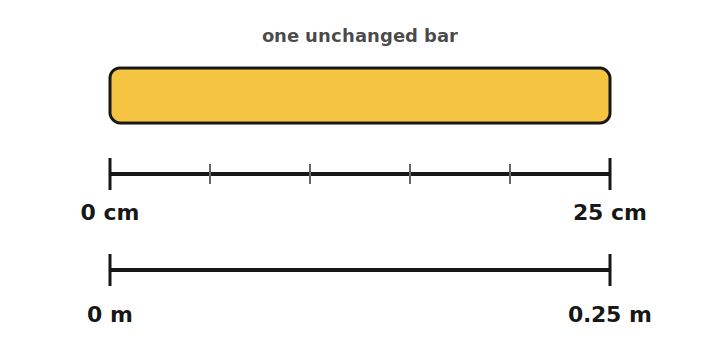
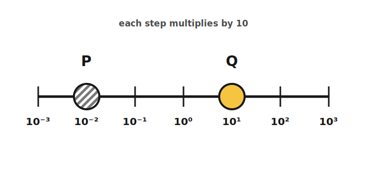
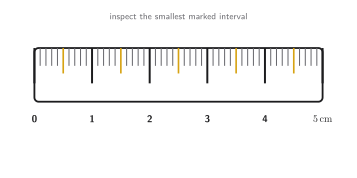
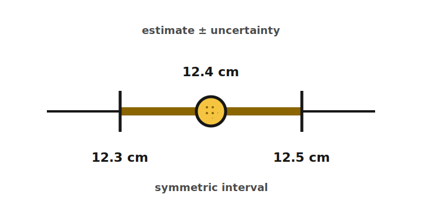
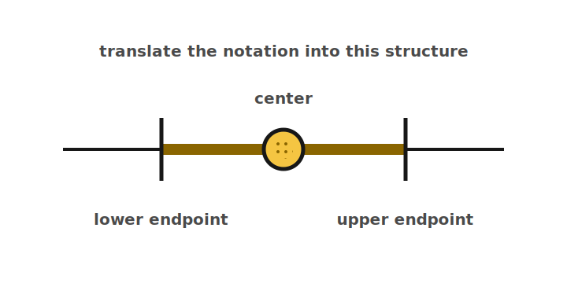

+++
order = 1
subject = "physics"
tags = ["mechanics", "physics", "measurement", "units", "dimensional-analysis"]
+++

# Foundations: models, measurement, and scale

This pilot assumes algebra and trigonometry but no physics vocabulary. The app
schedules only the `Q:/A:`, `C:`, and `P:/S:` blocks below, so the first
scheduled front in each learning sequence includes the minimum teaching bridge
needed for a cold start. The surrounding lesson prose remains a readable
reference and authoring record; later fronts never depend on the learner having
seen it.

## Lesson 1 — Physics connects models with evidence

A **system under study** is the part of the world we choose to describe. A
**physical model** is a deliberately simplified description of that system. A
useful model states relationships clearly enough to make a **prediction**: a
result that observations or measurements can check.

Evidence does not enter at the end of a rigid, one-way “scientific method.” The
work is iterative. A prediction guides a measurement; comparison with the
measurement can retain the model for further use, reveal a faulty measurement
or assumption, or motivate a revised model and another test. Agreement raises
confidence only within the tested conditions; it does not prove that the model
will work in every situation.

<!-- card-id: a690d74f-c012-4c62-ae07-aa3f84877e0a -->
Q: A physical model is a deliberately simplified description of a chosen system, and a prediction is a result that observations or measurements can check. Given those meanings, what makes a physical model useful rather than just a story?
A: It states relationships clearly enough to make predictions that observations or measurements can check. Its usefulness is bounded by the situations in which those checks support it.

<!-- card-id: 2c130f1c-7de5-4d91-bbdc-b77a83ee237a -->
Q: 

In this loop, what does the return from “compare” to “model” mean when a careful measurement disagrees with a prediction?
A: Recheck the measurement and assumptions, then revise or replace the model if the disagreement remains and test again. Disagreement is information about the model's limits or setup, not permission to change the data.

<!-- card-id: 06358250-f5d7-45d5-9176-f66e451b7e6a -->
Q: A model's prediction agrees with one careful measurement. What conclusion is justified—and what conclusion is not?
A: The result supports using the model under the tested conditions. It does not prove that the model is exact or universally valid; other models may make the same tested prediction, and new conditions can expose limits.

## Lesson 2 — A measurement is a comparison

A **physical quantity** is a measurable property, such as the length of a
tabletop. A **unit** is an agreed reference quantity of the same kind. To
measure the length is to compare it with a length unit. The reported **quantity
value** has two inseparable parts:

\[
\text{quantity value}=\text{numerical value}\times\text{unit}.
\]

For example, in \(25\ \mathrm{cm}\), \(25\) is the numerical value and
\(\mathrm{cm}\) is the unit symbol. The number alone is incomplete. Changing
units can change the numerical value without changing the physical quantity.

The **International System of Units (SI)** supplies shared reference units and
writing conventions. A **base unit** is one of SI's independently specified
units. A **derived unit** is formed by multiplying or dividing units. Mechanics
will repeatedly use the SI base units meter (m) for length, kilogram (kg) for
mass, and second (s) for time. For example, rectangle area is length times
length, so its SI unit is \(\mathrm{m^2}\).

At this stage, **mass** means the quantity that a balance compares between
objects; later chapters will develop its role in physical models. “Kilogram” is
the historical name of the SI base unit of mass, so learn \(\mathrm{kg}\) as
the base-unit symbol as a whole even though the name contains “kilo.”

In SI writing, leave a space between a number and a unit symbol
(\(25\ \mathrm{cm}\), not \(25\mathrm{cm}\)); do not pluralize a symbol
(\(4\ \mathrm{kg}\), not \(4\ \mathrm{kgs}\)).

<!-- card-id: 04c3b227-e83a-49bf-9f3d-d3a24fd84efb -->
Q: A measurement reports a quantity value as a numerical value times an agreed reference called a unit. In SI mechanics, examples include meter (m) for length, second (s) for time, and kilogram (kg) for mass. What information does the unit supply that the numerical value alone does not?
A: The unit names the agreed reference used for comparison. Without it, a number such as 25 does not say what kind or size of quantity was measured.

<!-- card-id: b1ad52fa-a210-4322-b926-8656cc4d6cd7 -->
Q: 

Why can the same bar have numerical values 25 and 0.25 without changing its physical length?
A: The unit changed: \(25\ \mathrm{cm}=0.25\ \mathrm{m}\). A larger unit requires fewer copies to describe the same quantity, so the number changes while the length does not.

<!-- card-id: 59a25f74-cc2c-4268-bf56-02749c208eb0 -->
C: In SI, the base unit for length is the [meter (m)].

<!-- card-id: 062d9073-888b-458e-b20e-fa5d7a054dfc -->
C: In SI, the base unit for time is the [second (s)].

<!-- card-id: e2f0c0c2-4428-489a-9fb2-120c855a0542 -->
C: In SI, the base unit for mass is the [kilogram (kg)].

<!-- card-id: f7634bc0-25ae-4d28-a771-bdd7e984e2c4 -->
Q: A rectangle's two side lengths are both measured in meters. Why is its area unit \(\mathrm{m^2}\), not \(\mathrm{m}\)?
A: Area is the product of two lengths, so its unit is \(\mathrm{m}\times\mathrm{m}=\mathrm{m^2}\). The exponent records the two length factors.

<!-- card-id: a351bf58-a90e-48b4-b2c4-3ebf500749f0 -->
Q: SI writing leaves a space between a number and its unit symbol and does not pluralize the symbol. Using those conventions, how should “a measured length of twenty-five centimeters” be written?
A: \(25\ \mathrm{cm}\). Put a space between the number and unit symbol, and do not add a plural “s” to the symbol.

## Lesson 3 — Prefixes and conversion factors

An SI **prefix** scales a unit by a power of ten:

| Prefix | Symbol | Factor |
|---|---:|---:|
| kilo | k | \(10^3\) |
| centi | c | \(10^{-2}\) |
| milli | m | \(10^{-3}\) |

The prefix symbol attaches directly to the unit symbol: \(\mathrm{km}\),
\(\mathrm{cm}\), and \(\mathrm{mm}\). A standalone \(\mathrm{m}\) means
meter; the first \(\mathrm{m}\) in \(\mathrm{mm}\) is the prefix milli.

A **conversion factor** is a ratio of equal quantity values, so its value is
one. From \(1\ \mathrm{m}=100\ \mathrm{cm}\), both
\(1\ \mathrm{m}/100\ \mathrm{cm}\) and its reciprocal equal one. Choose the
orientation that cancels the old unit.

Analyzed example: convert \(250\ \mathrm{cm}\) to meters.

- **IDENTIFY:** The physical length stays fixed; only its unit changes.
- **PLAN:** Multiply by the factor with centimeters in the denominator.
- **EXECUTE:** \(250\ \mathrm{cm}\,(1\ \mathrm{m}/100\ \mathrm{cm})=2.50\ \mathrm{m}\).
- **EVALUATE:** Centimeters cancel. Because a meter is larger than a centimeter, the numerical value should decrease; \(2.50<250\), as expected.

This Identify–Plan–Execute–Evaluate structure is abbreviated **IPEE**. Its final
step is a genuine check, not merely a claim that the arithmetic is correct.

<!-- card-id: f09a9c12-c887-44b2-b533-40898de14e05 -->
Q: A conversion factor is a ratio of equal quantity values, such as \(1\ \mathrm{m}/100\ \mathrm{cm}\), so its value is one. When converting a quantity to a new unit, how do you choose which way to write that factor?
A: Orient the factor so the old unit cancels and the desired unit remains. The factor equals one, so it changes the representation, not the physical quantity.

<!-- card-id: 0157c655-706a-4c70-9a2b-2dc2df8989f6 -->
P: A path is \(3.6\ \mathrm{km}\) long. Convert this length to meters using \(1\ \mathrm{km}=1000\ \mathrm{m}\), and include a check.
S: **IDENTIFY:** This is a unit conversion of one fixed length.

**PLAN:** Use the conversion factor with kilometers in the denominator.

**EXECUTE:** \(3.6\ \mathrm{km}\,(1000\ \mathrm{m}/1\ \mathrm{km})=3.6\times10^3\ \mathrm{m}\).

**EVALUATE:** Kilometers cancel, leaving meters. A meter is smaller than a kilometer, so the numerical value should increase; \(3600>3.6\).

<!-- card-id: 38c77cf8-229d-4cf9-bfc1-784777cdacc3 -->
P: Convert \(48\ \mathrm{mm}\) to meters using \(1\ \mathrm{m}=1000\ \mathrm{mm}\). Show the unit cancellation and check whether the numerical value should increase or decrease.
S: \(48\ \mathrm{mm}\,(1\ \mathrm{m}/1000\ \mathrm{mm})=0.048\ \mathrm{m}\). Millimeters cancel; because meters are the larger unit, a value below one meter is sensible.

## Lesson 4 — Dimensions check equation structure

A **dimension** identifies the kind of quantity without choosing a unit. In
mechanics, the base-dimension symbols are \(L\) for length, \(M\) for mass, and
\(T\) for time. A length has dimension \(L\) whether it is reported in meters,
centimeters, or another length unit. Area has dimension \(L^2\).

Dimensions combine through the same multiplication and division as quantities.
If \(r=d/t\), where \(d\) is a length and \(t\) is a time interval, then
\([r]=L/T=LT^{-1}\). Square brackets here mean “the dimension of the
enclosed quantity.”

An equation is **dimensionally consistent** only if quantities being added or
equated have the same dimensions. This is a powerful error check, but only a
necessary one: a dimensionally consistent equation can still have a wrong
number, sign, or model.

<!-- card-id: 63f24a70-ba97-49d8-ab82-eb3169908b13 -->
Q: A dimension names the kind of quantity without choosing a measurement standard: length has dimension \(L\) whether measured in meters or centimeters. Given that description, what is the difference between a dimension and a unit?
A: The dimension names the quantity's kind, such as length \(L\); the unit names the chosen comparison standard, such as meter or centimeter. Units can change while the dimension stays the same.

<!-- card-id: 9b2cdf42-7277-4922-9fa3-cf0f2a7d900c -->
Q: A dimensional-consistency check requires quantities that are added or set equal to have the same dimension. Can a length and a time pass that check if they are added? Why or why not?
A: No. Length has dimension (L), while time has dimension (T); changing units cannot make those unlike dimensions addable.

<!-- card-id: af2d3be5-415a-48f4-85bf-72be6ea02924 -->
P: A proposed rectangle formula is \(A=\ell+w\), where \(A\) is area and \(\ell\) and \(w\) are lengths. Use dimensions to decide whether the formula can be correct.
S: **IDENTIFY:** This is a dimensional-consistency check.

**PLAN:** Compare both sides using \([A]=L^2\) and \([\ell]=[w]=L\).

**EXECUTE:** The left side has dimension \(L^2\); the right side \(\ell+w\) has dimension \(L\). They do not match.

**EVALUATE:** The formula cannot be correct. A valid area formula must produce two factors of length, such as \(\ell w\).

<!-- card-id: f62bbcda-a10c-4591-9f99-aa0076027970 -->
P: A quantity is defined by \(r=d/t\), where \(d\) is measured in meters and \(t\) in seconds. Give the SI unit and dimension of \(r\).
S: Dividing the units gives \(\mathrm{m/s}\); dividing the dimensions gives \(L/T=LT^{-1}\). The unit and dimension show the same quotient structure at different levels.

<!-- card-id: f64f6c7a-0910-43c7-8793-061afc15c311 -->
Q: Why does dimensional consistency not prove that a proposed physical equation is correct?
A: Dimensions can rule out mismatched quantity kinds, but they cannot determine every numerical factor, sign, assumption, or model choice. Passing the check is necessary, not sufficient.

## Lesson 5 — Scientific notation makes scale visible

Scientific notation writes a nonzero number as \(a\times10^n\), where
\(1\le |a|<10\) and \(n\) is an integer. Moving the decimal point left raises
the exponent; moving it right lowers the exponent. For example,
\(4200=4.2\times10^3\) and \(0.0042=4.2\times10^{-3}\).

In this pilot, powers of ten provide a scale for comparison. A difference of
one exponent is a factor of 10; a difference of \(k\) exponents is a factor of
\(10^k\). Later estimation work can introduce the convention being used when
it asks for an “order of magnitude.”

<!-- card-id: 592595ee-f3af-4f38-9b11-f8e0d335ae24 -->
Q: Normalized scientific notation writes a nonzero number as \(a\times10^n\). What two conditions must the coefficient \(a\) and exponent \(n\) satisfy?
A: The exponent \(n\) is an integer, and the coefficient satisfies \(1\le |a|<10\).

<!-- card-id: 0d9f2d8d-203a-4d7d-b8c0-829d6f928258 -->
Q: Write \(0.0042\) in normalized scientific notation.
A: \(4.2\times10^{-3}\). The decimal moves three places right to make 4.2, so the exponent is \(-3\).

<!-- card-id: 2fdc606b-5cf5-4d52-9263-7221c63885b7 -->
P: 

How many times larger is scale Q than scale P? Use their exponent difference rather than counting ordinary tick spacing.
S: Q is at \(10^1\) and P is at \(10^{-2}\). Their exponent difference is \(1-(-2)=3\), so Q is \(10^3=1000\) times larger than P.

## Lesson 6 — Report what the measurement can support

A measuring **instrument** provides a scale or display. Its **resolution** is
the smallest change in the displayed or marked value that can be distinguished.
On a marked scale, inspect the difference between adjacent smallest marks.

A measured value is a best estimate, not an exact copy of nature. A complete
measurement result pairs that estimate with a **measurement uncertainty** that
describes the spread of values reasonably attributable to the measured
quantity under the stated procedure. Instrument resolution can contribute to
uncertainty, but variation among repeated readings, alignment, an imperfect
instrument scale, and the chosen method can make the total uncertainty larger.

The notation \(12.4\pm0.1\ \mathrm{cm}\) gives a best estimate of
\(12.4\ \mathrm{cm}\) and a symmetric uncertainty interval from
\(12.3\ \mathrm{cm}\) to \(12.5\ \mathrm{cm}\). The \(\pm\) value is not a
known mistake to subtract; it communicates limited knowledge.

**Significant figures** are the digits retained to communicate numerical
precision—how finely the written number distinguishes nearby values. Leading
zeros only locate the decimal point, so \(0.04\) has one
significant figure. Written trailing zeros after a decimal can communicate
additional precision, so \(0.0400\) has three. Significant figures are a compact
convention, not a replacement for an explicit uncertainty.

Defined conversions and counted integers are exact; they do not impose a new
measurement uncertainty. When an uncertainty has been rounded according to the
chosen reporting convention, round the best estimate to the same decimal place.
For example, \(12.347\ \mathrm{cm}\) with uncertainty
\(0.2\ \mathrm{cm}\) is reported as \(12.3\pm0.2\ \mathrm{cm}\).

<!-- card-id: 82278597-b23a-41f8-ab7a-2425a034feb7 -->
Q: An instrument's resolution is the smallest change in its displayed or marked value that can be distinguished. On a marked scale, inspect the difference between adjacent smallest marks.

What is the resolution of this marked scale, expressed in centimeters?
A: \(0.1\ \mathrm{cm}\). Each one-centimeter interval is divided into ten equal smallest intervals.

<!-- card-id: ccade793-ab41-48ad-ac3a-8cba6c05af87 -->
Q: In \(x\pm u\), \(x\) is the best estimate and \(u\) gives a symmetric interval extending \(u\) to either side.

Translate \(12.4\pm0.1\ \mathrm{cm}\) into a best estimate and interval.
A: The best estimate is \(12.4\ \mathrm{cm}\), with a symmetric interval from \(12.3\ \mathrm{cm}\) to \(12.5\ \mathrm{cm}\).

<!-- card-id: 3fe0f766-a70f-48ef-8c9f-1b601d0170d0 -->
Q: Why is an instrument's resolution not automatically the total uncertainty of a measurement result?
A: Resolution describes the smallest distinguishable scale or display change. Variation among repeated readings, alignment, an imperfect instrument scale, or the chosen method can make total uncertainty larger.

<!-- card-id: e4701dd9-9cc3-485d-9a10-0889b83be19f -->
Q: In measurement reporting, leading zeros only locate the decimal point, while written trailing zeros after a decimal can communicate retained precision. What precision difference is communicated by writing \(0.0400\ \mathrm{m}\) instead of \(0.04\ \mathrm{m}\)?
A: \(0.0400\ \mathrm{m}\) has three significant figures, while \(0.04\ \mathrm{m}\) has one. The two trailing zeros after the decimal communicate retained precision; the leading zeros do not.

<!-- card-id: b7797989-5c1e-4783-9e34-ce79bcd53bce -->
Q: Why does the exact definition \(1\ \mathrm{m}=100\ \mathrm{cm}\) not limit the significant figures of a converted measurement?
A: The defined conversion factor is exact; it adds no measurement uncertainty. The precision remains limited by the measured input, not by the numbers 1 or 100 in the definition.

<!-- card-id: 6eb791ac-a16b-4ff2-b628-6c4aa81d6b21 -->
P: A measurement analysis gives a best estimate of \(7.836\ \mathrm{cm}\) and a rounded uncertainty of \(0.05\ \mathrm{cm}\). Report the result with matching decimal places.
S: \(7.84\pm0.05\ \mathrm{cm}\). The uncertainty reaches the hundredths place, so the best estimate is rounded to the hundredths place as well.

<!-- card-id: 3caad80e-66f7-43ff-8eea-8c172a6f4974 -->
Q: A proposed equation adds a quantity measured in meters to one measured in seconds. Which chapter-1 tool directly diagnoses the problem: unit conversion or dimensional analysis?
A: Dimensional analysis. Conversion can change meters to another length unit or seconds to another time unit, but it cannot make unlike dimensions addable.
