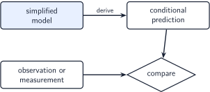
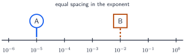
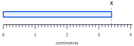
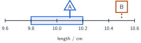

+++
order = 1
subject = "physics"
tags = ["mechanics", "physics", "foundations", "measurement"]
+++

# Foundations: models, measurement, and scale

<!-- card-id: 32988205-5a53-4e4a-a91e-cd91453369dc -->
Q: A **physical model** is a deliberately simplified representation of a real situation, made for a stated purpose. What makes such a simplification useful rather than arbitrary?
A: It keeps the features needed to explain or predict the chosen aspect of the situation. A useful model states its purpose and can produce predictions that observations can test.

<!-- card-id: 91d32530-c893-45f1-8884-93d931477b41 -->
Q: A model keeps some features of a real situation and omits others. A **prediction** is what the model says should be observed under stated conditions. What should you ask before trusting one of its predictions?
A: Ask whether its assumptions and omitted features are reasonable for this situation and purpose. A model can be useful within one range of conditions and inadequate outside it.

<!-- card-id: c58ff7ae-c7de-42f2-aa25-d8fbca0e6e16 -->
Q: A **prediction** is what a model says should be observed under stated conditions; **evidence** is an observation or measurement used for comparison.

If prediction and evidence repeatedly disagree after obvious measurement problems are checked, what should be reconsidered?
A: Reconsider the model's assumptions, its range of applicability, or the model itself. Evidence can support a model for tested conditions, but agreement does not prove that it is the only possible model.

<!-- card-id: 7dfe3ed8-9583-40b9-8fb0-a317dd85c028 -->
Q: A **physical quantity** is a property that can be compared by magnitude. A **quantity value** expresses that magnitude as a number times a unit. In “the length is \(2.4\ \mathrm{m}\),” identify the quantity, numerical value, and unit.
A: Quantity: length. Numerical value: \(2.4\). Unit: metre, symbol \(\mathrm{m}\). The quantity value is \(2.4\ \mathrm{m}\).

<!-- card-id: c3c7c120-8400-4ab5-9c85-acc6c721b666 -->
Q: The International System of Units (SI) supplies standard references. The three SI base-unit mappings used in this chapter are length–metre (\(\mathrm{m}\)), mass–kilogram (\(\mathrm{kg}\)), and time–second (\(\mathrm{s}\)). Why is the bare statement “the length is 2.4” incomplete?
A: It gives a numerical value without a unit, so the magnitude is not fixed. For example, \(2.4\ \mathrm{m}\) and \(2.4\ \mathrm{cm}\) are different quantity values.

<!-- card-id: f9ed80c5-4916-4dfd-8eae-5307cea02711 -->
C: In SI, the base unit of length is [the metre (\(\mathrm{m}\))].

<!-- card-id: 9e501db1-252a-4b2b-9ad0-4ab5597aee17 -->
C: In SI, the base unit of mass is [the kilogram (\(\mathrm{kg}\))].

<!-- card-id: c6d05828-2d10-4616-83f7-ab1e9cb3fd2e -->
C: In SI, the base unit of time is [the second (\(\mathrm{s}\))].

<!-- card-id: 14af6aec-9a1e-4ebc-b12a-23f04af2c0a9 -->
Q: A quantity value is a product of a number and a unit, so SI writing places a space between them. Rewrite `12cm` correctly.
A: \(12\ \mathrm{cm}\). The prefix and unit symbol stay attached to each other, but the numerical value is separated from the unit symbol by a space.

<!-- card-id: 64c176ac-c061-4e1d-aeec-c519a7068294 -->
Q: Diagnose `5 kgs` as an SI quantity value.
A: Write \(5\ \mathrm{kg}\). Unit symbols are mathematical symbols: they do not take a plural `s` or a period, and their capitalization is fixed.

<!-- card-id: a52675ca-c8fd-4cf2-a618-79c8ce1fd474 -->
Q: For a rectangle, area is defined as length times length. If both lengths are measured in metres, what unit expresses the area?
A: Square metres, \(\mathrm{m^2}\), because \(\mathrm{m}\times\mathrm{m}=\mathrm{m^2}\).

<!-- card-id: df2362d5-5aa8-4b29-be0b-1d5dcf313ea7 -->
Q: An SI prefix is an exact power-of-ten factor attached directly to a unit symbol: \(\mathrm{k}=10^3\), \(\mathrm{c}=10^{-2}\), \(\mathrm{m}=10^{-3}\), \(\mathrm{\mu}=10^{-6}\), and \(\mathrm{n}=10^{-9}\). Using that grammar, what does \(1\ \mathrm{mm}\) mean in metres?
A: \(1\ \mathrm{mm}=1\times10^{-3}\ \mathrm{m}\). Here the first `m` is the prefix symbol milli and the second is the unit symbol metre; attachment and context distinguish their roles.

<!-- card-id: 0b73abb8-bf10-4e60-9d75-c1c9f2962f0a -->
C: The SI prefix kilo, symbol \(\mathrm{k}\), multiplies a unit by [\(10^3\)].

<!-- card-id: caf46752-32e3-454c-b1d7-d21e42a7c0bc -->
C: The SI prefix centi, symbol \(\mathrm{c}\), multiplies a unit by [\(10^{-2}\)].

<!-- card-id: 5df85f93-c803-4ac6-a8bb-e58049fa1296 -->
C: The SI prefix milli, symbol \(\mathrm{m}\), multiplies a unit by [\(10^{-3}\)].

<!-- card-id: c05436b7-d047-4d59-bd64-3847c8f07a37 -->
C: The SI prefix micro, symbol \(\mathrm{\mu}\), multiplies a unit by [\(10^{-6}\)].

<!-- card-id: e9820e3c-b757-4f70-b322-952b9d57b52b -->
C: The SI prefix nano, symbol \(\mathrm{n}\), multiplies a unit by [\(10^{-9}\)].

<!-- card-id: 1dcffc18-a1ee-44f9-9b57-45c1993fb9f2 -->
P: A **conversion factor** is a ratio equal to one, written so the old unit cancels. Convert \(2.5\ \mathrm{m}\) to centimetres using \(1\ \mathrm{m}=100\ \mathrm{cm}\).
S: **IDENTIFY:** This is a unit conversion; the physical quantity must not change.

**PLAN:** Multiply by the form of one that places metres in the denominator: \(100\ \mathrm{cm}/1\ \mathrm{m}\).

**EXECUTE:** \(2.5\ \mathrm{m}\left(\frac{100\ \mathrm{cm}}{1\ \mathrm{m}}\right)=250\ \mathrm{cm}\).

**EVALUATE:** Metres cancel, centimetres remain, and the numerical value grows because centimetres are smaller units.

<!-- card-id: fb3f0a53-fab1-468a-9c77-84056a985e1c -->
P: Complete the conversion: \(3.6\ \mathrm{cm}\left(\frac{1\ \mathrm{m}}{\_\_\_\ \mathrm{cm}}\right)=\ ?\ \mathrm{m}\).
S: **IDENTIFY:** Convert centimetres to metres without changing the length.

**PLAN:** Use \(1\ \mathrm{m}=100\ \mathrm{cm}\), with centimetres in the denominator.

**EXECUTE:** The blank is \(100\), and \(3.6\ \mathrm{cm}\left(\frac{1\ \mathrm{m}}{100\ \mathrm{cm}}\right)=0.036\ \mathrm{m}\).

**EVALUATE:** The old unit cancels; the numerical value becomes smaller in the larger unit.

<!-- card-id: 4008367f-a665-413d-9b5a-4593fe42c159 -->
P: Convert \(0.035\ \mathrm{m}\) to millimetres. Choose and show a conversion factor.
S: **IDENTIFY:** Convert metres to millimetres.

**PLAN:** Since \(1\ \mathrm{m}=1000\ \mathrm{mm}\), use \(1000\ \mathrm{mm}/1\ \mathrm{m}\).

**EXECUTE:** \(0.035\ \mathrm{m}\left(\frac{1000\ \mathrm{mm}}{1\ \mathrm{m}}\right)=35\ \mathrm{mm}\).

**EVALUATE:** The units cancel correctly, and a smaller unit gives a larger numerical value.

<!-- card-id: 51509268-4837-48a3-a4a7-56af48297190 -->
Q: Why is \(1\ \mathrm{cm^2}=10^{-4}\ \mathrm{m^2}\), not \(10^{-2}\ \mathrm{m^2}\)?
A: The prefix is part of the unit being squared: \(1\ \mathrm{cm^2}=(10^{-2}\ \mathrm{m})^2=10^{-4}\ \mathrm{m^2}\).

<!-- card-id: 3747aef4-3967-410e-8f50-84a780bac17b -->
Q: A **dimension** identifies the kind of quantity independently of the chosen unit. In mechanics, the base-dimension symbols are \(L\) for length, \(M\) for mass, and \(T\) for time. What stays the same when one length is written as \(2.4\ \mathrm{m}\) or \(240\ \mathrm{cm}\), and what changes?
A: Its dimension—length—stays the same; its unit and numerical value change. Unit conversion changes representation, not the physical quantity or its dimension.

<!-- card-id: f6108ff6-1fc7-4f3d-b1bb-1bb4fe5b9d71 -->
Q: In dimensional notation, \([q]\) means “the dimension of quantity \(q\).” A valid quantity equation has the same dimensions on both sides, and quantities can be added or subtracted only when their dimensions match. What do the base-dimension symbols \(L\), \(M\), and \(T\) mean in mechanics?
A: \(L\) means length, \(M\) mass, and \(T\) time.

<!-- card-id: 0a3abc08-d6a1-4982-9f7e-90f498fd60e8 -->
Q: What dimensional condition must every valid quantity equation satisfy?
A: Both sides of the equation must have the same dimensions, and terms that are added or subtracted must share a dimension. This is **dimensional consistency**.

<!-- card-id: 582ec8eb-06ff-4a0f-a006-9e76a91aa7eb -->
P: A rectangle has side lengths \(\ell\) and \(w\), so \([\ell]=[w]=L\), while its area has \([A]=L^2\). Which candidate is dimensionally consistent: \(A=\ell+w\) or \(A=\ell w\)?
S: **IDENTIFY:** Compare the dimensions of each right-hand side with \([A]=L^2\).

**PLAN:** Addition preserves the shared dimension; multiplication multiplies dimensions.

**EXECUTE:** \([\ell+w]=L\), so \(A=\ell+w\) is inconsistent. \([\ell w]=L\cdot L=L^2\), so \(A=\ell w\) is consistent.

**EVALUATE:** The surviving candidate also matches the defining geometry of rectangular area.

<!-- card-id: 28c99e3d-7ecf-42ac-bd41-3cfb2ce16b02 -->
Q: Both \(A=\ell w\) and \(A=2\ell w\) are dimensionally consistent for an area. What does this show about dimensional analysis?
A: Dimensional consistency is necessary but not sufficient for physical correctness. It cannot determine a dimensionless numerical factor or verify a model's assumptions.

<!-- card-id: 909a90e6-fc54-459a-bab5-4ec7ea4f5aec -->
Q: In normalized scientific notation, a nonzero number is \(a\times10^n\) with \(1\le |a|<10\) and integer \(n\). For \(4.2\times10^{-5}\), identify the coefficient and exponent and state what the negative exponent means.
A: The coefficient is \(4.2\) and the exponent is \(-5\). The factor \(10^{-5}\) means moving five powers of ten below one, so the value is \(0.000042\).

<!-- card-id: 5b85c0f3-c166-40ea-bfae-362aeddf7aab -->
P: Write \(0.000073\) in normalized scientific notation.
S: **IDENTIFY:** Move the decimal so the coefficient lies from 1 up to, but not including, 10.

**PLAN:** Moving the decimal five places right must be balanced by \(10^{-5}\).

**EXECUTE:** \(0.000073=7.3\times10^{-5}\).

**EVALUATE:** Expanding \(7.3\times10^{-5}\) moves the decimal five places left and recovers the original value.

<!-- card-id: 7640b39a-1029-489f-a71c-a2704aca20c8 -->
Q: On this powers-of-ten scale, adjacent labeled ticks differ by one in the exponent. One such exponent step is called one **order of magnitude**.

What multiplicative change does one equal step to the right represent?
A: A factor of \(10\). Equal distances on this scale represent equal **ratios**, not equal ordinary differences.

<!-- card-id: 9198e62d-9ff4-4fd8-b30e-09b5a4e2e859 -->
P: In the scale below, point A is at \(10^{-5}\) and point B is at \(10^{-2}\). How many orders of magnitude separate them, and what is the ratio \(B/A\)?

S: **IDENTIFY:** Compare powers of ten by subtracting exponents.

**PLAN:** Compute \((-2)-(-5)\), then form \(10\) to that power.

**EXECUTE:** The separation is \(3\) orders of magnitude, and \(B/A=10^3=1000\).

**EVALUATE:** The figure shows three equal rightward steps, each multiplying by \(10\).

<!-- card-id: 1fb9d75a-efe9-43d1-a9d4-719120841dda -->
Q: Instrument **resolution** is the smallest change in the measured quantity that causes a perceptible change in the instrument's indication—its displayed or readable value. What is the resolution of this ruler?

A: \(0.1\ \mathrm{cm}\), equivalently \(1\ \mathrm{mm}\), because adjacent smallest tick marks are separated by that amount.

<!-- card-id: bb0a7ffb-01c8-4546-8183-a28c1f2b640a -->
Q: **Measurement uncertainty** characterizes the spread of quantity values reasonably attributable to what was measured, based on the available information. Why can a measured value alone be incomplete when the uncertainty is not negligible?
A: The value alone hides how tightly the result is known. Reporting uncertainty communicates the relevant spread; it does not mean the measurement was a mistake.

<!-- card-id: 57cb429b-2c14-473f-b591-d853407c082c -->
Q: What is the decisive difference between instrument resolution and measurement uncertainty?
A: Resolution concerns the smallest change the instrument can visibly distinguish. Uncertainty concerns the measurement result and may include resolution plus calibration, reading, method, environment, and other information, so it is not automatically equal to one division.

<!-- card-id: cd8b160a-2783-41db-a71a-c2c28a36c95a -->
Q: For this chapter's elementary problems, an explicit result \(x=(10.0\pm0.2)\ \mathrm{cm}\) is declared to represent the interval from \(10.0-0.2\) to \(10.0+0.2\). The value and uncertainty use the same unit and align at the same decimal place. What interval is stated?
A: \(9.8\ \mathrm{cm}\) to \(10.2\ \mathrm{cm}\).

<!-- card-id: 874d09bb-8841-4490-baeb-fc99f2e01655 -->
P: A measured length is reported as \((10.0\pm0.2)\ \mathrm{cm}\); for this problem, treat it as the interval \(9.8\) to \(10.2\ \mathrm{cm}\). A prediction is **compatible** when it lies inside that interval. Model A predicts \(10.1\ \mathrm{cm}\); model B predicts \(10.5\ \mathrm{cm}\). Which prediction is compatible?

S: **IDENTIFY:** Compare each prediction with the declared measurement interval.

**PLAN:** A prediction is compatible here exactly when its value lies from \(9.8\) through \(10.2\ \mathrm{cm}\).

**EXECUTE:** \(10.1\ \mathrm{cm}\) lies inside, so A is compatible. \(10.5\ \mathrm{cm}\) lies outside, so B is not.

**EVALUATE:** This comparison supports A over B for this test; it does not prove A uniquely correct in every condition.

<!-- card-id: d4632ee3-71a4-4357-b38b-cadacbab2e40 -->
Q: **Significant figures** are the digits retained to communicate the precision of a reported numerical value. For later counting: leading zeros are placeholders; zeros between significant digits are significant; trailing zeros written after a decimal point are significant; and ambiguous trailing zeros in an integer should be clarified with scientific notation. What do significant figures communicate, and what do they not replace?
A: They communicate which digits are being reported as meaningful at the chosen precision. They do not replace an explicit uncertainty statement or describe every source of measurement uncertainty.

<!-- card-id: ddb9bbee-1ee3-41d7-925a-ebf3fdf4fcfa -->
Q: In \(0.0042\), why are the zeros before \(4\) not significant figures?
A: They only locate the decimal point; they are placeholders. The value has two significant figures: \(4\) and \(2\).

<!-- card-id: 823c53de-2de1-4a94-a34b-c6022beafb27 -->
Q: How many significant figures are in \(4.02\), and why?
A: Three. A zero between nonzero significant digits is significant.

<!-- card-id: 24eec063-3901-4be5-abdc-30083bbb70a0 -->
Q: The writing \(1500\ \mathrm{m}\) does not show whether one or both trailing zeros are significant. How can you state unambiguously that the value has two significant figures?
A: Write \(1.5\times10^3\ \mathrm{m}\). Scientific notation makes the retained significant digits explicit.

<!-- card-id: 8dc28628-1924-4c58-b738-8cefb6f0d239 -->
P: How many significant figures are in \(0.004050\ \mathrm{m}\)?
S: **IDENTIFY:** Separate placeholder zeros from zeros that lie within or after the reported digits.

**PLAN:** Ignore leading placeholders; count from the first nonzero digit through the final reported decimal zero.

**EXECUTE:** The significant digits are \(4,0,5,0\), so there are \(4\) significant figures.

**EVALUATE:** Scientific notation gives \(4.050\times10^{-3}\ \mathrm{m}\), which displays the same four digits clearly.

<!-- card-id: 71b4e2c0-28dd-441d-9832-11e087f8515f -->
Q: Exact defined conversion factors carry no measurement uncertainty and do not limit reported precision. For \(2.30\ \mathrm{cm}=0.0230\ \mathrm{m}\), how many significant figures should the converted value retain?
A: Three. An exact conversion factor changes the unit and numerical representation but does not reduce the measurement's reported precision.

<!-- card-id: 6e1f43bd-8233-4c61-9f7f-8b890eeb822f -->
P: For elementary significant-figure reporting, a product is rounded to the fewest significant figures among the measured inputs, with rounding done once at the end. A rectangle measures \(2.4\ \mathrm{cm}\) by \(3.15\ \mathrm{cm}\). Report its area.
S: **IDENTIFY:** Area is a product, and the inputs have two and three significant figures.

**PLAN:** Multiply using guard digits, then round the final result to two significant figures.

**EXECUTE:** \(A=(2.4)(3.15)\ \mathrm{cm^2}=7.56\ \mathrm{cm^2}\), which rounds to \(7.6\ \mathrm{cm^2}\).

**EVALUATE:** The dimension is \(L^2\), the unit is \(\mathrm{cm^2}\), and the answer has the required two significant figures.

<!-- card-id: 0ac523bc-6891-4972-bde4-dd48b814c616 -->
P: For elementary significant-figure reporting, a sum is rounded to the least precise decimal place among the measured inputs. Two strips measured end-to-end have lengths \(12.11\ \mathrm{cm}\) and \(0.3\ \mathrm{cm}\). Report their combined length.
S: **IDENTIFY:** This is addition; \(0.3\ \mathrm{cm}\) is reported only to the tenths place.

**PLAN:** Add with guard digits, then round the result to tenths.

**EXECUTE:** \(12.11\ \mathrm{cm}+0.3\ \mathrm{cm}=12.41\ \mathrm{cm}\), reported as \(12.4\ \mathrm{cm}\).

**EVALUATE:** The unit remains centimetres, and the final decimal place matches the least precise input place.

<!-- card-id: 622c89f0-9450-4bd9-b283-927d274ba105 -->
P: The strip ends at X on the ruler below. Read to the nearest marked division. For this problem only, use half of one smallest division as the instrument-only uncertainty. Report the result in centimetres with value and uncertainty aligned to the same decimal place, then convert both exactly to metres.

S: **IDENTIFY:** The smallest division is \(0.1\ \mathrm{cm}\), the endpoint is \(3.4\ \mathrm{cm}\), and the declared uncertainty rule gives half a division.

**PLAN:** Use \(u=0.05\ \mathrm{cm}\), align the value to hundredths, then multiply both value and uncertainty by the exact factor \(1\ \mathrm{m}/100\ \mathrm{cm}\).

**EXECUTE:** \(x=(3.40\pm0.05)\ \mathrm{cm}=(0.0340\pm0.0005)\ \mathrm{m}\).

**EVALUATE:** Units cancel in the conversion, the physical interval is unchanged, and the explicit uncertainty is more informative than significant figures alone.
