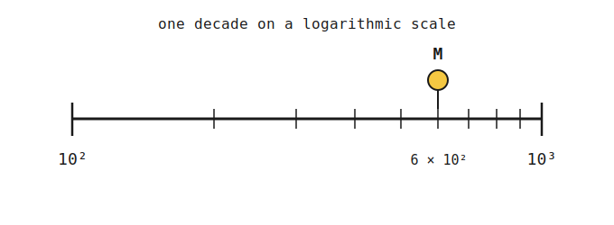
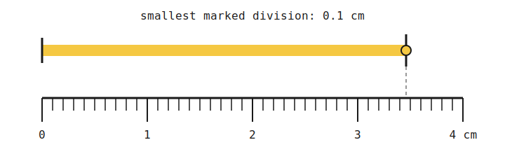
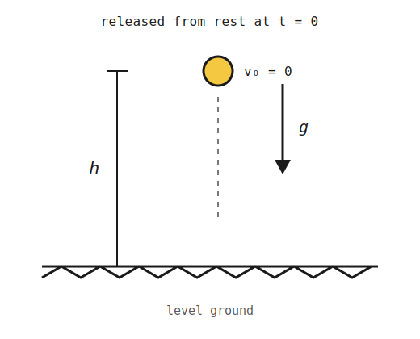

+++
order = 1
subject = "physics"
tags = ["mechanics", "physics", "measurement", "units", "dimensional-analysis"]
+++

# Classical Mechanics — Foundations

## 1.1 Why Classical Mechanics

<!-- card-id: card-b511f64f-6dd1-4d74-a1e8-4a993c05fe14 -->
<!-- card-alias: 0601affc31ed9aca469b310eb85296fbcb011e54557fb6d5d7756a6154b2f7c9 -->
Q: What does "classical" mean in "classical mechanics"?
A: Non-quantum and non-relativistic. It describes the motion of everyday macroscopic objects at speeds much less than the speed of light ($v \ll c$).

<!-- card-id: card-9cf87a2f-abb4-4e78-9aed-827f1949dffb -->
<!-- card-alias: 3e0d1a37eb1bbde5a4481bfdded1a07c246a0a16225cd77b83bbd56f71f0bab5 -->
Q: Why is classical mechanics studied before quantum or relativistic mechanics?
A: It is built on Galileo's experimental foundation and Newton's laws, which accurately describe everyday phenomena. It provides the conceptual framework that quantum and relativistic theories extend or correct.

<!-- card-id: card-050b8c7a-821f-4bd3-99c9-cbe499bc45f0 -->
<!-- card-alias: 87582702a67056df1c97555c9ecbe52a2a77f7b5956491fb10a1e7d7c61d0f94 -->
Q: What is the practical validity range of classical mechanics?
A: Objects that are macroscopic (not atomic-scale) and moving at speeds much less than the speed of light. Outside this range — very small scales or very high speeds — quantum or relativistic corrections are required.

<!-- card-id: card-6113bee8-a53a-4262-9884-54832b7a0211 -->
<!-- card-alias: 72482cdc408924a5263470321d729fb57d5213de674bec6f7ee2f200e3acb5a6 -->
C: Classical mechanics is organized around [Newton's laws] as its central framework.

## 1.2 The Scientific Method

<!-- card-id: card-dee8d2e4-a84f-4747-99e2-67413d04c310 -->
<!-- card-alias: 3df9b6248b9fc14c2b235de34700f2e0ec566e7ad5157b46e9b6e37091bc8c59 -->
Q: Why is falsifiability essential in physics?
A: A claim that cannot in principle be disproved by experiment provides no predictive power and is outside the domain of science. Falsifiability ensures theories can be tested and potentially overturned by evidence.

<!-- card-id: card-6e602272-eb12-4408-a20c-b16942d25889 -->
<!-- card-alias: 25591c025da4852b8d6bdd301f27d575d7c3b5b88b0339760dd837b3c45b5e1e -->
C: A scientific hypothesis must lead to [testable predictions] that evidence could support or contradict.

<!-- card-id: card-b42f4ee9-5496-4fb4-b0c8-6fb6f1fa6715 -->
<!-- card-alias: b9ee1153dce2454995a8cf5a8966d3590e16b4c63dd9af4694301a797f08c4ab -->
Q: What distinguishes a "theory" in physics from a guess?
A: A physical theory is a well-tested model that has survived repeated experimental scrutiny and makes quantitative predictions. In everyday language "theory" implies uncertainty; in physics it implies established, validated explanation.

<!-- card-id: card-c2526464-dcd0-4fc3-948a-034f739900cd -->
<!-- card-alias: 5ad2ca1d839dac5a64b64b1ab7d76a56c8a68ffe04d58dc8db1b6fe962922ca9 -->
Q: What is a hypothesis in physics?
A: A testable initial conjecture, not yet validated by experiment.

<!-- card-id: card-e3a4c00e-0de2-4417-91e7-bf7d59e12430 -->
<!-- card-alias: 13f99fd16e201009f1627c4e390295e7b7d5ee40f8cd3d811b7612c0d2cf9de3 -->
Q: What distinguishes a physical law from a theory?
A: A law concisely describes an observed regularity (often mathematical) but doesn't explain why; a theory provides the explanatory framework.

## 1.3 SI Units and Base Quantities

<!-- card-id: card-74e18507-7772-4028-9909-9c48f3a83a97 -->
<!-- card-alias: c10b44fbfa3048d3378cd91d6249499e16c64ce5f67ac7b615c164a35eb4cfff -->
Q: Why does physics use a standardized unit system?
A: Standardization ensures measurements are reproducible and comparable worldwide. Without agreed units, numerical results cannot be shared or verified across laboratories.

<!-- card-id: card-c5895427-77bd-49f3-8238-a3b09e1d600d -->
<!-- card-alias: 219373226fd13ca582985b524263f51d0331495bdcb2687cf1b11b8ade731152 -->
C: The SI system has [7] base quantities from which all other units are derived.

<!-- card-id: card-4ce5513d-367f-4037-a3f7-5d24ee600e49 -->
<!-- card-alias: 6622d4e20f69ebd07288eaaf3502683a2459975f6355f296d05f609d92163c01 -->
C: The SI unit of mass is the [kilogram (kg)].

<!-- card-id: card-d190cd2a-75f5-4a8f-90b1-6c38116f843b -->
<!-- card-alias: e3f7c4126aa75e09953b99df958755c413e4d9ecae05f2af0e7ff63e7569ea80 -->
C: The SI unit of length is the [meter (m)].

<!-- card-id: card-c30ed22a-1cf1-438d-b8e8-ac795a4e5118 -->
<!-- card-alias: c0c57dbe66793e5b9f7115992902922053ab5c56c51a31fe8c9a6e3f66b803a7 -->
C: The SI unit of time is the [second (s)].

<!-- card-id: card-3e91ba4f-67b3-4799-bf20-045f5c19315b -->
<!-- card-alias: 0420e35e36d7baa90eac03399e525883f339635b4b81ed44e8d1afd3856a7047 -->
Q: Name the seven SI base quantities and their units.
A: Mass (kg), length (m), time (s), electric current (A), thermodynamic temperature (K), amount of substance (mol), luminous intensity (cd).

<!-- card-id: card-d4880c75-09df-4a58-82fe-1a7d697007dc -->
<!-- card-alias: e9d2e89554d4d90ec52f8c6529e29642d7c04306f7e4e2df8ef6b1195358aaae -->
Q: What are derived units in SI?
A: Units formed by combining base units through multiplication or division. For example, velocity has units m/s, force has units kg·m/s² (called the Newton, N).

## 1.4 Dimensional Analysis

<!-- card-id: card-08e2abc5-21eb-4968-a235-0c1a0d442b47 -->
<!-- card-alias: 1de31ef192ae808873b5efeca4a88279321359b45bc4f98b4b8f0358dd43a73d -->
Q: Why must every valid physical equation be dimensionally consistent?
A: Because you cannot add or equate quantities of different physical kinds — adding a length to a time is meaningless. Dimensional consistency is a necessary (though not sufficient) condition for a correct equation.

<!-- card-id: card-b4c83975-851c-4cb2-a7c0-97a8907d8439 -->
<!-- card-alias: 325688944ea8f60eca713f5de72595104441befc6fa52148ec6a498f12d833a2 -->
C: The notation $\lbrack v \rbrack = \text{L/T}$ means the [dimension] of velocity is length divided by time.

<!-- card-id: card-bf6d9187-c673-48b5-ad21-438d535a2b55 -->
<!-- card-alias: 3d8dc4419d1326be9691603424e73dce9134efa6bc62d00b55d43e4f9c8d20ea -->
Q: How do you check whether a proposed equation is dimensionally consistent?
A: Replace every quantity with its dimensions (L, M, T, etc.) and verify that the dimensions on the left-hand side equal those on the right-hand side.

<!-- card-id: card-57cec2a1-8a76-4c52-a435-2a0bd6bfa0ed -->
<!-- card-alias: 5eb89a32286b9efd8a1f9762f1bb7988178f6a9a5f23d8e54109e7f3b82020fe -->
Q: How can dimensional analysis be used to derive a relationship (without full physics)?
A: By identifying which physical quantities are relevant and requiring the combination to have the correct dimensions, you can determine the form of the equation up to a dimensionless constant. Example: distance must combine speed and time as $d \sim v \cdot t$ because $[\text{L}] = [\text{L/T}]\cdot[\text{T}]$.

<!-- card-id: card-ddc71c10-bda4-451f-bac9-e98902ca8de8 -->
<!-- card-alias: 27e2deadf6f445a0c2a69a38173746c4732a31c79bf4d480fff8bea607b944a0 -->
C: Dimensional analysis can check equations and [derive relationships] between physical quantities up to a dimensionless constant.

## 1.5 Order-of-Magnitude Estimation

<!-- card-id: card-1a076df2-fb2f-4efb-971d-6fc8e5fa5e95 -->
<!-- card-alias: 3f0a15d5ae6f1cf4bbfe1ed9233321224b970c94d3b2de22a8bb9522c9ef0bef -->
Q: Why estimate before calculating exactly?
A: An order-of-magnitude estimate reveals the scale of the answer, catches setup errors early, and builds physical intuition. An exact answer that is orders of magnitude off likely indicates a conceptual mistake.

<!-- card-id: card-f7869e3c-35b9-4ca4-b867-b5d91f3912ec -->
<!-- card-alias: a0fd0b8a397d05f159f633868aec911fbd4efbff916c9ca9caed7969a9fda737 -->
Q: What is the Fermi estimation technique?
A: Break a complex quantity into simpler sub-quantities you can estimate individually (each to one significant figure or nearest power of 10), then multiply or divide them. The product gives an order-of-magnitude answer.

<!-- card-id: card-e0dd5a54-e210-49f6-9137-9f1b80df3ef3 -->
<!-- card-alias: ea7fc7496cc5ee5b03d49135e9d179db9ddfa1891b11a55074389304a8a967f5 -->
C: In Fermi estimation, quantities are expressed as [powers of 10] and combined to give an order-of-magnitude result.

<!-- card-id: card-035506db-a4cb-43eb-83ac-a7f5c616e15d -->
<!-- card-alias: d5db44458ec5efbac75279ece3da344944661c5be92eccad6b0570496e42718a -->
Q: What are the steps in an order-of-magnitude estimate?
A: Identify the controlling quantities, estimate each to one significant digit or a nearby power of ten, combine them, then check whether the scale and units are plausible.

<!-- card-id: card-0164a7ce-c85f-4345-93e3-318306625784 -->
Q: Point $M$ marks $6\times10^2$ on the logarithmic scale. To the nearest power of ten, what is its order of magnitude, and why?

A: Its order of magnitude is $10^3$. On a logarithmic scale, the boundary between $10^2$ and $10^3$ is their geometric mean, $\sqrt{10^2\cdot10^3}\approx3.16\times10^2$, and $6\times10^2$ lies above it.

## 1.6 Significant Figures

<!-- card-id: card-b47c52df-f589-4763-923e-66e959c1b3a0 -->
<!-- card-alias: ec0816c53a1529b3553c2ee21d2c2566ffe47c1c424774592d84527c57f2d894 -->
Q: What do significant figures represent?
A: The precision of a measurement. Reporting more significant figures than the measurement device can resolve is misleading; reporting fewer discards real information.

<!-- card-id: card-e3a5d2cd-fc98-4f29-8b7a-8b12f1fb02eb -->
Q: The ruler's smallest marked division is $0.1\,\text{cm}$. Read the yellow object's endpoint with appropriate precision. Which digit is estimated?

A: The reading is approximately $3.46\,\text{cm}$; the hundredths digit, $6$, is estimated between the $3.4$ and $3.5\,\text{cm}$ marks. The tenths digit is fixed by the scale, while one additional digit is reported by interpolation.

<!-- card-id: card-a1c54f77-666e-4b6b-a4bc-4b2fc2c6957c -->
<!-- card-alias: fff6cd3f15e3c995e6b02700d839cb309e6351f0bbaf928f1d91c870eeb46b3e -->
Q: What is the rule for significant figures in addition and subtraction?
A: The result should have the same number of decimal places as the measurement with the fewest decimal places.

<!-- card-id: card-b77e8d27-d6b7-427b-a853-4e341d1513e4 -->
<!-- card-alias: 6e64730806713e116c70bb1ebe274594e9ebc35dfa6f3e789b0d82e44d1f1850 -->
Q: What is the rule for significant figures in multiplication and division?
A: The result should have the same number of significant figures as the measurement with the fewest significant figures.

<!-- card-id: card-3b816f0d-fd49-4a1b-805e-bcafdb796580 -->
<!-- card-alias: 8c6a8b6ea2c75e7f4f785f22c29e8f140194dc2bc4a0029de7ac005945734367 -->
C: In multiplication and division, the result keeps as many significant figures as the measurement with the [fewest] significant figures.

<!-- card-id: card-5d4e9ce4-b03c-4e83-b58c-1e41589df309 -->
<!-- card-alias: 4037ec1ac0bcb74127bdc436d3b1265938a977bd28ba4e79edb89060789d2387 -->
C: In addition and subtraction, the result is rounded to the [least number of decimal places] among all measurements.

<!-- card-id: card-0a2b5a53-3d3c-46d2-a03b-1df08e478711 -->
<!-- card-alias: 97ee4084ad338d40d463cc03e2ace58cde86d05dc042abe9832e9a6862340204 -->
Q: Why must precision in a final answer be justified by the measurements?
A: Writing extra digits implies a precision that was never measured, which is misleading. Physical results can only be as precise as the least precise input.

## 1.7 Worked Example — Dimensional Analysis of Free Fall

<!-- card-id: card-73a91d37-cf6c-49d7-9818-887028440e4d -->
<!-- card-alias: 96a7affa20ed2b2bccde51543a4204cc351c7f90d938443e92692f06c4e2b363 -->
P: A stone is released from rest at height $h$ above the ground. Without using the kinematic equations, use dimensional analysis alone to determine how the time of fall $t$ depends on $h$ and the gravitational acceleration $g$, up to a dimensionless constant.

S:
**IDENTIFY**: We want $t$ as a function of $h$ (dimension L) and $g$ (dimension L/T²). Assume a power-law form $t = C\,h^a g^b$, where $C$ is a dimensionless constant and $a$, $b$ are unknown exponents.

**PLAN**:
- Write the dimensional equation: $[t] = [h]^a[g]^b$.
- Expand and collect powers of each base dimension (L and T).
- Match the powers on both sides and solve for $a$ and $b$.

**EXECUTE**:

Dimensions: $[t] = T$, $[h] = L$, $[g] = L/T^2 = LT^{-2}$.

$$T = L^a(LT^{-2})^b = L^{a+b}\,T^{-2b}$$

Matching powers of each base dimension:
- Powers of $L$: $a + b = 0$
- Powers of $T$: $-2b = 1 \implies b = -\tfrac{1}{2}$

Substitute back: $a = -b = +\tfrac{1}{2}$.

Therefore $t \sim h^{1/2}g^{-1/2} = \sqrt{h/g}$.

**EVALUATE**:
- The exact kinematic result is $t = \sqrt{2h/g}$, so the dimensionless constant is $C = \sqrt{2} \approx 1.41$ — of order unity as expected ✓
- Dimensional analysis cannot pin down $C$, only the functional form. This is the generic limitation of the method.
- Sanity check: doubling $h$ multiplies $t$ by $\sqrt{2}$, not by 2 — consistent with intuition that falling twice as far takes less than twice as long because the object speeds up ✓
