+++
order = 2
subject = "physics"
tags = ["mechanics", "physics", "vectors", "vector-algebra"]
+++

# Vectors and coordinate representations

<!-- card-id: 06a489ff-49b0-454f-a3f6-9de93b5c50a0 -->
Q: A **scalar quantity** is fully specified by a magnitude (a number and unit). A **vector quantity** also requires a direction. A vector is drawn as an arrow: its tail is the starting point, its length represents magnitude, and its head gives direction.

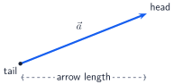

Classify “an area of \(6\ \mathrm{cm^2}\)” and “a directed length of \(6\ \mathrm{cm}\) toward the right” as scalar or vector.
A: The area is scalar; the directed length is vector. The first needs only a magnitude and unit, while the second is not fully specified without its direction.

<!-- card-id: 11e3de95-666a-48ec-812f-7469123887fb -->
Q: **Free vectors** may be translated without changing them. They are equal exactly when they have the same magnitude and direction; **opposite vectors** have equal magnitude and opposite directions.

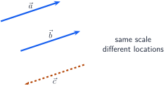

What are the relationships among \(\vec a\), \(\vec b\), and \(\vec c\)?
A: \(\vec a=\vec b\), and \(\vec c=-\vec a=-\vec b\). Location alone does not distinguish free vectors.

<!-- card-id: 70287949-f00b-436e-9400-60d64f332b16 -->
Q: Multiplying \(\vec a\) by a scalar \(k\) multiplies its magnitude by \(|k|\); a negative \(k\) reverses its direction.

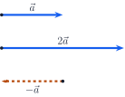

If \(|\vec a|=4\ \mathrm{cm}\), what magnitude and direction does \(-1.5\vec a\) have relative to \(\vec a\)?
A: Magnitude \(6\ \mathrm{cm}\), in the direction opposite to \(\vec a\). The factor \(1.5\) scales the magnitude and the minus sign reverses the direction.

<!-- card-id: 4edd95c7-d593-4812-8091-38f41f24abf7 -->
Q: The **zero vector** \(\vec 0\) has magnitude zero and acts as the additive identity: \(\vec a+\vec 0=\vec a\). Why is no unique direction assigned to \(\vec 0\)?
A: Every arrow of zero length collapses to the same point, so no direction is distinguished. Its components are all zero in every Cartesian coordinate system.

<!-- card-id: 807abae5-6865-4f0c-81d8-6becf859e29c -->
Q: A Cartesian coordinate system uses perpendicular signed axes. A vector's \(x\)- and \(y\)-**components** are its signed projections along those axes.

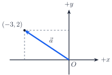

What are the signs of \(a_x\) and \(a_y\), and what feature of the diagram determines each sign?
A: \(a_x<0\) and \(a_y>0\). The arrow's projection points toward negative \(x\) and positive \(y\); a component is signed, not merely a projection length.

<!-- card-id: 8c05517d-1b77-4834-a14c-66a5e08a6486 -->
Q: The dimensionless unit vectors \(\hat{\mathbf i}\) and \(\hat{\mathbf j}\) point along \(+x\) and \(+y\). Thus \(\vec a=a_x\hat{\mathbf i}+a_y\hat{\mathbf j}\), equivalently \(\vec a=\langle a_x,a_y\rangle\). In three dimensions, \(\hat{\mathbf k}\) points along \(+z\). Write \(\langle-3,2\rangle\) in unit-vector form.
A: \(\vec a=-3\hat{\mathbf i}+2\hat{\mathbf j}\). The minus sign belongs to the \(x\)-component, not to the unit-vector definition.

<!-- card-id: 6c8cdaad-03d3-4261-83af-f3bf4cdfc0d0 -->
Q: A vector \(\vec a=\langle3,4\rangle\ \mathrm{cm}\) represents a directed length. What units belong to \(a_x\), \(a_y\), \(\hat{\mathbf i}\), and \(\hat{\mathbf j}\)?
A: \(a_x=3\ \mathrm{cm}\) and \(a_y=4\ \mathrm{cm}\); the components carry the vector's unit. \(\hat{\mathbf i}\) and \(\hat{\mathbf j}\) specify direction only and are dimensionless.

<!-- card-id: f51e399b-11e0-49d8-89e9-a8867b4bdb66 -->
Q: In this deck, a two-dimensional **direction angle** \(\theta\) is measured counterclockwise from \(+x\). For magnitude \(a=|\vec a|\), the components are \(a_x=a\cos\theta\) and \(a_y=a\sin\theta\).

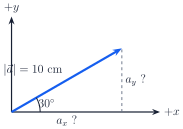

Why does cosine give the \(x\)-component and sine the \(y\)-component in this diagram?
A: In the right triangle, \(a_x\) is adjacent to \(\theta\) and \(a_y\) is opposite it, with \(a\) as the hypotenuse. Therefore \(a_x/a=\cos\theta\) and \(a_y/a=\sin\theta\).

<!-- card-id: b9073117-d80f-4e29-8aba-981e77275033 -->
P: The vector in the figure has magnitude \(10\ \mathrm{cm}\) and direction angle \(30^\circ\). Find its Cartesian components.

S: **IDENTIFY:** Decompose a magnitude and direction angle measured from \(+x\).

**PLAN:** Use \(a_x=a\cos\theta\) and \(a_y=a\sin\theta\).

**EXECUTE:** \(a_x=10\cos30^\circ=5\sqrt3\approx8.66\ \mathrm{cm}\), and \(a_y=10\sin30^\circ=5.00\ \mathrm{cm}\).

**EVALUATE:** Both components are positive in the first quadrant, and \(\sqrt{a_x^2+a_y^2}=10\ \mathrm{cm}\).

<!-- card-id: 5213ca4d-e4b9-4b82-bd13-c7ef7124ba08 -->
P: For \(\vec a=\langle-3,4\rangle\ \mathrm{cm}\), reconstruct its magnitude and direction angle. Use \(a=\sqrt{a_x^2+a_y^2}\), and make an explicit quadrant check because \(\tan^{-1}(a_y/a_x)\) alone does not identify opposite quadrants.
S: **IDENTIFY:** Convert signed components to magnitude and a counterclockwise angle from \(+x\).

**PLAN:** Compute the Pythagorean magnitude. The signs \((-,+)\) place the vector in quadrant II, so adjust the reference angle accordingly (or use a two-argument \(\operatorname{atan2}(a_y,a_x)\)).

**EXECUTE:** \(a=\sqrt{(-3)^2+4^2}=5\ \mathrm{cm}\). The reference angle is \(\tan^{-1}(4/3)\approx53.1^\circ\), so \(\theta=180^\circ-53.1^\circ=126.9^\circ\).

**EVALUATE:** \(5\cos126.9^\circ\approx-3\) and \(5\sin126.9^\circ\approx4\), recovering the component signs and values.

<!-- card-id: f4fdc77e-efe4-4d84-af11-8d0b0dac35e3 -->
P: Independently reconstruct the magnitude and direction angle \(0^\circ\le\theta<360^\circ\) of \(\vec b=\langle-6,-8\rangle\ \mathrm{mm}\).
S: **IDENTIFY:** The signs \((-,-)\) place \(\vec b\) in quadrant III.

**PLAN:** Use the Pythagorean magnitude and add the quadrant-III reference angle to \(180^\circ\).

**EXECUTE:** \(b=\sqrt{(-6)^2+(-8)^2}=10\ \mathrm{mm}\). The reference angle is \(\tan^{-1}(8/6)\approx53.1^\circ\), so \(\theta\approx233.1^\circ\).

**EVALUATE:** \(10\cos233.1^\circ\approx-6\) and \(10\sin233.1^\circ\approx-8\); both reconstructed components have the required signs.

<!-- card-id: e6605184-ec1c-4824-ae9c-0f7852102f9e -->
Q: The same geometric vector \(\vec a\) is shown against two coordinate systems sharing an origin.

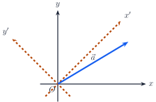

Which properties of \(\vec a\) change when only the coordinate axes are rotated, and which do not?
A: Its numerical components and direction angle relative to the chosen \(+x\)-axis change. The geometric vector, its magnitude, and the angle between it and any other fixed vector do not.

<!-- card-id: 69fc4955-1a73-45d6-b4a9-94213a055cb2 -->
Q: To add vectors graphically, translate \(\vec b\) without rotating it so its tail is at the head of \(\vec a\). The sum runs from the first tail to the final head.

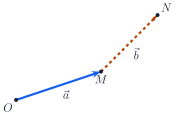

In the figure, where does \(\vec a+\vec b\) begin and end?
A: It begins at \(O\) and ends at \(N\). The intermediate point \(M\) is the head-to-tail join, not the endpoint of the sum.

<!-- card-id: 3c9157be-345f-43a0-a02a-d7653a6e366e -->
Q: For \(\vec a=\langle a_x,a_y\rangle\) and \(\vec b=\langle b_x,b_y\rangle\), what is the component rule for \(\vec a+\vec b\), and why does it agree with head-to-tail addition?
A: \(\vec a+\vec b=\langle a_x+b_x,\,a_y+b_y\rangle\). Each signed coordinate change accumulates independently along its axis, producing the same overall tail-to-head arrow.

<!-- card-id: 7326721d-9821-4942-aef0-7be381245486 -->
P: A head-to-tail construction uses \(\vec a=\langle2,-1\rangle\ \mathrm{cm}\) followed by \(\vec b=\langle-5,4\rangle\ \mathrm{cm}\). Find the sum and its magnitude.
S: **IDENTIFY:** Add corresponding components, then compute the magnitude.

**PLAN:** Form \(\langle a_x+b_x,a_y+b_y\rangle\) and apply the Pythagorean relation.

**EXECUTE:** \(\vec a+\vec b=\langle-3,3\rangle\ \mathrm{cm}\), so \(|\vec a+\vec b|=\sqrt{(-3)^2+3^2}=3\sqrt2\ \mathrm{cm}\).

**EVALUATE:** The negative \(x\)- and positive \(y\)-components place the sum in quadrant II, consistent with its component signs.

<!-- card-id: 96518076-0fe6-4f62-93a9-5f420afa617f -->
Q: Vector subtraction is addition of an opposite: \(\vec a-\vec b=\vec a+(-\vec b)\).

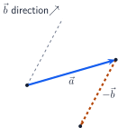

Graphically, where does the arrow for \(\vec a-\vec b\) run in this construction?
A: From the tail of \(\vec a\) to the head of the translated \(-\vec b\). Equivalently, when \(\vec a\) and \(\vec b\) share a tail, it runs from the head of \(\vec b\) to the head of \(\vec a\).

<!-- card-id: e4ef1243-e4a2-4c2a-aa49-722c76273321 -->
P: Let \(\vec a=\langle3,-2\rangle\) and \(\vec b=\langle-1,4\rangle\). Compute \(2\vec a-\vec b\) and state its quadrant.
S: **IDENTIFY:** This mixes scalar multiplication and subtraction componentwise.

**PLAN:** Compute \(2\vec a\), then add the opposite of \(\vec b\).

**EXECUTE:** \(2\vec a-\vec b=\langle6,-4\rangle-\langle-1,4\rangle=\langle7,-8\rangle\).

**EVALUATE:** Positive \(x\) and negative \(y\) place the result in quadrant IV. Re-expanding \(\langle7,-8\rangle+\langle-1,4\rangle\) recovers \(2\vec a=\langle6,-4\rangle\).

<!-- card-id: 93f4d3b0-0e7c-4660-acfe-e44cc90233ee -->
Q: The **dot product** of \(\vec a\) and \(\vec b\) is the scalar
\(\vec a\cdot\vec b=a_xb_x+a_yb_y+a_zb_z=ab\cos\theta\), where \(\theta\) is the smaller included angle from \(0^\circ\) to \(180^\circ\). What geometric relationship does this scalar measure?
A: It measures signed directional alignment: how much one vector lies along the other, scaled by both magnitudes. For fixed magnitudes, parallel same-direction vectors give the largest positive value; perpendicular vectors give zero; opposite-direction vectors give the most negative value.

<!-- card-id: c1f60721-10e0-498c-8662-ed35ccea1111 -->
Q: Each case shows two nonzero vectors with an acute, right, or obtuse included angle.

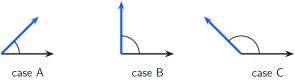

What is the sign of the dot product in cases A, B, and C?
A: A: positive; B: zero; C: negative. The sign follows \(\cos\theta\): positive for acute, zero at \(90^\circ\), and negative for obtuse angles.

<!-- card-id: f8626734-feb8-49bf-9d27-8daf0372f72e -->
Q: The signed scalar component of \(\vec a\) along the direction of \(\vec b\) is \(\operatorname{comp}_{\vec b}\vec a=\vec a\cdot\hat{\mathbf b}=a\cos\theta\), where \(\hat{\mathbf b}=\vec b/b\).

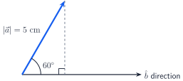

What is the signed scalar component shown?
A: \(5\cos60^\circ=2.5\ \mathrm{cm}\). It is positive because the projection points along \(+\hat{\mathbf b}\).

<!-- card-id: a2c2304d-7edd-40a6-940d-d9f3b530f420 -->
Q: The **vector projection** of \(\vec a\) onto nonzero \(\vec b\) is
\(\operatorname{proj}_{\vec b}\vec a=(\vec a\cdot\hat{\mathbf b})\hat{\mathbf b}=\frac{\vec a\cdot\vec b}{b^2}\vec b\). How does it differ from the scalar component \(\operatorname{comp}_{\vec b}\vec a\)?
A: The scalar component is a signed number with \(\vec a\)'s unit; the vector projection is a vector pointing along or opposite \(\vec b\) with that signed amount encoded in its direction and magnitude.

<!-- card-id: 0ab31270-f220-4d24-8a97-bc0debabf33c -->
P: Let \(\vec a=\langle3,4\rangle\ \mathrm{cm}\), and let the dimensionless vector \(\vec b=\langle1,1\rangle\) specify a direction. Find the scalar component and vector projection of \(\vec a\) along \(\vec b\).
S: **IDENTIFY:** Project \(\vec a\) onto the direction of a non-unit vector \(\vec b\).

**PLAN:** Use \(\operatorname{comp}_{\vec b}\vec a=(\vec a\cdot\vec b)/b\) and \(\operatorname{proj}_{\vec b}\vec a=(\vec a\cdot\vec b/b^2)\vec b\).

**EXECUTE:** \(\vec a\cdot\vec b=7\ \mathrm{cm}\), \(b=\sqrt2\), and \(b^2=2\). Thus \(\operatorname{comp}_{\vec b}\vec a=7/\sqrt2\ \mathrm{cm}\), and \(\operatorname{proj}_{\vec b}\vec a=\langle7/2,7/2\rangle\ \mathrm{cm}\).

**EVALUATE:** The remainder \(\vec a-\operatorname{proj}_{\vec b}\vec a=\langle-1/2,1/2\rangle\ \mathrm{cm}\) has dot product zero with \(\vec b\), so it is perpendicular to the projection direction.

<!-- card-id: 81db768a-fd19-47d2-8f2c-9c42e2a0f103 -->
P: Find the smaller included angle between \(\vec a=\langle2,1\rangle\) and \(\vec b=\langle-1,3\rangle\). Use the dot product and check whether the angle should be acute, right, or obtuse before evaluating an inverse cosine.
S: **IDENTIFY:** Recover an included angle from \(\vec a\cdot\vec b=ab\cos\theta\).

**PLAN:** Compute the dot product and magnitudes; the dot-product sign predicts the angle class.

**EXECUTE:** \(\vec a\cdot\vec b=-2+3=1>0\), so the angle is acute. With \(a=\sqrt5\) and \(b=\sqrt{10}\), \(\theta=\cos^{-1}(1/\sqrt{50})\approx81.9^\circ\).

**EVALUATE:** The computed angle is acute as predicted, and substituting its cosine recovers the dot product \(1\).

<!-- card-id: a4f828f9-362c-4235-918a-153075491842 -->
Q: In three-dimensional Cartesian space, the **cross product** \(\vec a\times\vec b\) is a vector perpendicular to both input vectors; it is defined for the ordered pair of 3-D vectors. How does its result type differ from that of \(\vec a\cdot\vec b\)?
A: The cross product returns a vector, while the dot product returns a scalar. The cross product's direction carries orientation information that a scalar cannot.

<!-- card-id: a3dc0de4-2dec-4926-9064-3ae08c38b370 -->
Q: For the **right-hand rule**, curl the fingers of your right hand through the smaller angle from the first vector toward the second; your thumb gives the cross-product direction.

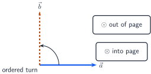

Does \(\vec a\times\vec b\) point out of or into the page, and what happens to the direction for \(\vec b\times\vec a\)?
A: \(\vec a\times\vec b\) points out of the page; \(\vec b\times\vec a\) points into it. Reversing the order negates the cross product: \(\vec b\times\vec a=-(\vec a\times\vec b)\).

<!-- card-id: 91688688-24e3-473e-ad08-dbb3aae6dc19 -->
Q: For included angle \(\theta\), \(|\vec a\times\vec b|=ab\sin\theta\).

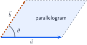

What geometric quantity does this magnitude equal, and when is it zero for nonzero vectors?
A: It equals the area of the parallelogram spanned by \(\vec a\) and \(\vec b\). It is zero when the vectors are parallel or antiparallel, because then \(\sin\theta=0\).

<!-- card-id: c8177589-45ea-4649-9d66-4a75c02d2107 -->
P: For \(\vec a=\langle a_x,a_y,a_z\rangle\) and \(\vec b=\langle b_x,b_y,b_z\rangle\), the component rule is
\[
\vec a\times\vec b=\langle a_yb_z-a_zb_y,\ a_zb_x-a_xb_z,\ a_xb_y-a_yb_x\rangle.
\]
Use it to compute \(\hat{\mathbf i}\times\hat{\mathbf j}\), where \(\hat{\mathbf i}=\langle1,0,0\rangle\) and \(\hat{\mathbf j}=\langle0,1,0\rangle\).
S: **IDENTIFY:** Apply the ordered cross-product component rule.

**PLAN:** Substitute the components in the displayed formula, keeping the middle component's order \(a_zb_x-a_xb_z\).

**EXECUTE:** \(\hat{\mathbf i}\times\hat{\mathbf j}=\langle0,0,1\rangle=\hat{\mathbf k}\).

**EVALUATE:** \(\hat{\mathbf k}\) is perpendicular to both inputs, has unit magnitude, and its direction matches the right-hand rule from \(+x\) toward \(+y\).

<!-- card-id: b6070e26-2ab9-4464-9f79-7416744a9dd6 -->
P: Compute \(\vec a\times\vec b\) for \(\vec a=\langle2,-1,3\rangle\) and \(\vec b=\langle1,4,-2\rangle\). Then verify perpendicularity using dot products.
S: **IDENTIFY:** This is a cross-product component calculation followed by an orthogonality check.

**PLAN:** Apply the ordered component rule, then dot the result with each input.

**EXECUTE:** \(\vec a\times\vec b=\langle(-1)(-2)-3(4),\ 3(1)-2(-2),\ 2(4)-(-1)(1)\rangle=\langle-10,7,9\rangle\). Checks: \(\langle-10,7,9\rangle\cdot\vec a=-20-7+27=0\), and its dot product with \(\vec b\) is \(-10+28-18=0\).

**EVALUATE:** Both zero dot products confirm that the result is perpendicular to both inputs; reversing the input order would negate all three components.

<!-- card-id: 6c2e8115-8ab6-466b-9615-4f930be2890e -->
P: Independently compute \(\vec a\times\vec b\) and the parallelogram area for \(\vec a=\langle1,2,0\rangle\) and \(\vec b=\langle0,1,3\rangle\). State \(\vec b\times\vec a\) without recalculating it.
S: **IDENTIFY:** The cross product supplies both an oriented perpendicular vector and the spanned area.

**PLAN:** Compute \(\vec a\times\vec b\), take its magnitude, then reverse its sign for the swapped order.

**EXECUTE:** \(\vec a\times\vec b=\langle6,-3,1\rangle\). The area is \(\sqrt{6^2+(-3)^2+1^2}=\sqrt{46}\). Therefore \(\vec b\times\vec a=\langle-6,3,-1\rangle\).

**EVALUATE:** \(\langle6,-3,1\rangle\cdot\vec a=6-6=0\) and \(\langle6,-3,1\rangle\cdot\vec b=-3+3=0\), confirming perpendicularity; area is nonnegative even though direction changes with order.

<!-- card-id: b517dd78-b8f5-4141-9e7b-b9b3b6661f1c -->
Q: Choose the product for each target: (i) a signed scalar measure of directional alignment or projection, and (ii) an oriented perpendicular vector whose magnitude is a spanned parallelogram area.
A: (i) Use the dot product. (ii) Use the cross product. The desired result type—scalar alignment versus oriented area vector—is the decisive distinction.
