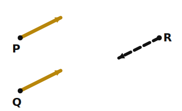
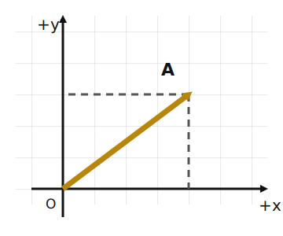
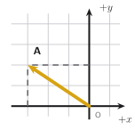
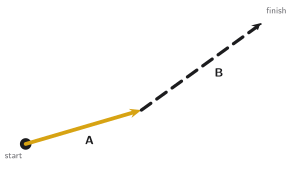
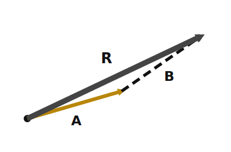
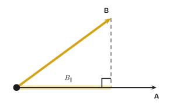
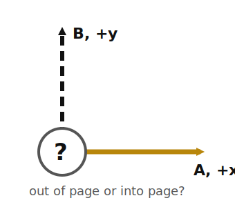
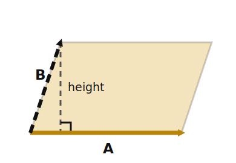

+++
order = 2
subject = "physics"
tags = ["mechanics", "physics", "vectors", "math", "dot-product", "cross-product"]
+++

# Vectors: arrows, components, and products

This chapter begins with geometric arrows. It assumes only the scheduled
chapter-1 cards plus algebra, plane geometry, and trigonometry. The prose is a
reference; every prerequisite needed during scheduled review is introduced on
a `Q:/A:` or `P:/S:` front before later cards use it.

## Lesson 1 — An arrow can encode size and direction

A geometric arrow has a **tail** where it begins and a **head** marked by the
arrowhead. Its length represents a nonnegative **magnitude**, and the arrowhead
represents its direction. Moving an arrow without rotating or stretching it
does not change the vector it represents.

<!-- card-id: 2c581265-26a2-4f41-84f2-154c557d9105 -->
Q: A geometric vector is represented by an arrow: its length encodes magnitude, and its arrowhead encodes direction. What must match for two arrows to represent the same vector?
A: They must have the same magnitude and the same direction. Their locations on the page do not have to match.

<!-- card-id: 7e9e7b45-cec0-400e-9949-853af87923bc -->
Q: 

Which labeled arrow represents the same vector as P, and what visual evidence decides it?
A: Q. It has the same length and direction as P; R has the same length but the opposite direction.

A **scalar** is fully specified by a numerical value and any unit it carries.
A **vector** also requires a direction. This distinction concerns what
information defines the quantity; it does not mean that every number must be
positive.

<!-- card-id: 522ff6f7-d850-49a7-8d00-9dd9ec6a7b05 -->
Q: A scalar is fully specified by a numerical value and any unit, while a vector also requires a direction. Which is vector information: “a length of \(5\ \mathrm{m}\)” or “an arrow of magnitude \(5\ \mathrm{m}\) pointing east”?
A: The arrow of magnitude \(5\ \mathrm{m}\) pointing east is vector information because both magnitude and direction are specified. The length \(5\ \mathrm{m}\) alone is scalar information.

Vector symbols are printed here with an arrow, such as \(\vec A\). The symbol
without the arrow, \(A\), denotes the magnitude; equivalently,
\(A=|\vec A|\).

<!-- card-id: 9880553d-2c01-49b1-bd1f-a711ff619f60 -->
Q: The notation \(\vec A\) denotes a vector, while \(A=|\vec A|\) denotes its magnitude. Why can \(A\) not be negative?
A: Magnitude is the arrow's length, so \(A\ge 0\).

<!-- card-id: 2bd5b2b2-fcd6-4b5b-858b-cfc932829e19 -->
Q: The opposite vector \(-\vec A\) is made by reversing \(\vec A\)'s arrow without changing its length. How do its magnitude and direction compare with those of \(\vec A\)?
A: It has the same magnitude as \(\vec A\) and the opposite direction. Thus \(|-\vec A|=|\vec A|\).

<!-- card-id: ce6aeeff-3115-46c6-bfec-23aeebb4d77c -->
Q: Multiplying a vector by a number scales its magnitude by the number's absolute value; a negative number also reverses direction. How does \(-2\vec A\) compare with \(\vec A\)?
A: It has twice the magnitude and points in the opposite direction.

## Lesson 2 — Components describe an arrow relative to chosen axes

A two-dimensional Cartesian coordinate system has a chosen **origin** and two
perpendicular axes. Here +x points right and +y points up. The signed scalar
components \(A_x\) and \(A_y\) say how much of \(\vec A\) lies along those
axis directions.

<!-- card-id: 39907800-42f3-4d37-800a-b12c3f709ecf -->
Q: In the Cartesian grid below, +x is right and +y is up. A vector's signed scalar components count its horizontal and vertical changes from tail to head.

What are \(A_x\) and \(A_y\)?
A: \(A_x=+4\) grid units and \(A_y=+3\) grid units. Both are positive because the arrow runs right and up.

<!-- card-id: 9684151a-da32-48bd-b1b7-d651586147da -->
Q: The x- and y-axes divide the plane into four quadrants, numbered counterclockwise starting with quadrant I in the upper right. This arrow is in quadrant II, the upper-left region.

With +x right and +y up, what are the signs of this vector's x- and y-components?
A: The x-component is negative and the y-component is positive. The arrow goes left (\(-x\)) and up (\(+y\)).

A **unit vector** has magnitude 1 and supplies direction without changing the
component's size. We use \(\hat{\mathbf i}\) along +x and
\(\hat{\mathbf j}\) along +y, so
\[
\vec A=A_x\hat{\mathbf i}+A_y\hat{\mathbf j}.
\]

<!-- card-id: 63c72303-bdee-41be-ad2b-ddc9458ee50f -->
Q: The unit vectors \(\hat{\mathbf i}\) and \(\hat{\mathbf j}\) have magnitude 1 and point along +x and +y. Write a vector with scalar components \(A_x=-2\) and \(A_y=5\) in unit-vector form.
A: \(\vec A=-2\hat{\mathbf i}+5\hat{\mathbf j}\). The coefficients give the signed amounts along the two axis directions.

A **direction angle** \(\theta\) will mean the angle measured counterclockwise
from +x to the vector, with \(0^\circ\le\theta<360^\circ\). Right-triangle
trigonometry gives
\[
A_x=A\cos\theta,\qquad A_y=A\sin\theta.
\]

<!-- card-id: 8d237cf6-f47b-486e-8a24-ed2386a3b23d -->
P: For a vector of magnitude \(A\) at a direction angle \(\theta\) measured counterclockwise from +x, right-triangle trigonometry gives \(A_x=A\cos\theta\) and \(A_y=A\sin\theta\). A vector has magnitude \(10\) grid units and \(\theta=30^\circ\). Find its components and check their signs and magnitude.
S: **IDENTIFY:** This is vector decomposition using a direction angle measured from +x.

**PLAN:** Use \(A_x=A\cos\theta\) and \(A_y=A\sin\theta\).

**EXECUTE:** \(A_x=10\cos30^\circ=5\sqrt3\) and \(A_y=10\sin30^\circ=5\), in grid units.

**EVALUATE:** Both components are positive because the arrow is in quadrant I. Also \(\sqrt{(5\sqrt3)^2+5^2}=10\), recovering the given magnitude.

<!-- card-id: 18ef7bbf-78a9-42b8-ac2f-ecb760c25ead -->
P: A vector has magnitude \(8\) grid units and direction angle \(120^\circ\), measured counterclockwise from +x. Find its components and use the quadrant to check their signs.
S: \(A_x=8\cos120^\circ=-4\) and \(A_y=8\sin120^\circ=4\sqrt3\), in grid units. An angle of \(120^\circ\) lies in quadrant II, so negative x and positive y are the required signs.

From components, the Pythagorean theorem gives
\(A=\sqrt{A_x^2+A_y^2}\). An inverse tangent supplies a reference angle, but
the component signs must choose the correct quadrant.

<!-- card-id: 64ad7ad7-c9ab-408c-8085-8db8af9568c4 -->
P: From components, use the Pythagorean theorem for magnitude and inverse tangent for a reference angle; the component signs select the quadrant. A vector has \(A_x=-6\) and \(A_y=8\) grid units. Find its magnitude and direction angle measured counterclockwise from +x.
S: **IDENTIFY:** Reconstruct a vector from its Cartesian components.

**PLAN:** Use \(A=\sqrt{A_x^2+A_y^2}\), then find the reference angle from \(\tan^{-1}(|A_y/A_x|)\) and place it in the quadrant fixed by the signs.

**EXECUTE:** \(A=\sqrt{(-6)^2+8^2}=10\) grid units. The reference angle is \(\tan^{-1}(8/6)\approx53.1^\circ\). Negative x and positive y place the vector in quadrant II, so \(\theta=180^\circ-53.1^\circ=126.9^\circ\).

**EVALUATE:** \(126.9^\circ\) points left and up, matching the component signs; substituting the angle recovers components approximately \((-6,8)\).

<!-- card-id: b499087a-b030-4d39-9f92-5d4b6e6c34b8 -->
Q: The same geometric arrow is described using one set of x/y axes and then using axes rotated on the page. What can change, and what must remain unchanged?
A: Its scalar components and direction angle can change because they are measured relative to the axes. The geometric vector—its magnitude and actual direction—remains unchanged.

<!-- card-id: 62ac7ea9-9e87-4645-8049-56ad2a1887d2 -->
Q: A vector quantity is measured in meters and written \(\vec A=A_x\hat{\mathbf i}+A_y\hat{\mathbf j}\). What units and dimension must \(A_x\) and \(A_y\) have?
A: Each component must have the same unit, meters, and the same dimension, length \(L\), as the vector quantity. Unit vectors supply direction and have magnitude 1; they do not change the component's unit.

## Lesson 3 — Add arrows before adding components

To add \(\vec A+\vec B\) geometrically, translate \(\vec B\) without rotating
or stretching it so its tail meets the head of \(\vec A\). The **resultant**
is the arrow from the original tail of \(\vec A\) to the final head of
\(\vec B\).

<!-- card-id: 112da66d-3555-4cc2-b477-6ffe0e2e33f7 -->
Q: To construct \(\vec A+\vec B\), place B's tail at A's head without rotating or stretching either arrow. The resultant is the single arrow representing that sum.

Where should the resultant begin and end?
A: It begins at A's original tail and ends at B's final head.

<!-- card-id: 3abc47bb-0b69-4182-840e-3e3c81bca8bb -->
Q: A tail-to-head sum combines the two horizontal changes and, separately, the two vertical changes. If \(\vec R=\vec A+\vec B\), how are \(R_x\) and \(R_y\) found from the input components?
A: Add matching components: \(R_x=A_x+B_x\) and \(R_y=A_y+B_y\). Horizontal and vertical contributions combine independently.

<!-- card-id: 240cf3e4-7bd0-401a-b1dc-8d3e7469b8a2 -->
P: The shorthand \(\vec A=(A_x,A_y)\) lists the x-component first and y-component second. On one Cartesian grid, \(\vec A=(3,-2)\) and \(\vec B=(-1,5)\), in grid units. Find \(\vec R=\vec A+\vec B\), then check by finding its magnitude.
S: **IDENTIFY:** This is vector addition in a common coordinate system.

**PLAN:** Add corresponding components.

**EXECUTE:** \(\vec R=(3+(-1),-2+5)=(2,3)\) grid units, or \(2\hat{\mathbf i}+3\hat{\mathbf j}\). Its magnitude is \(\sqrt{2^2+3^2}=\sqrt{13}\) grid units.

**EVALUATE:** The positive x- and y-components require a resultant pointing right and up, consistent with \((2,3)\).

<!-- card-id: 3af48404-eafa-43c5-bdbb-c0909a261913 -->
Q: Vector subtraction is defined by \(\vec A-\vec B=\vec A+(-\vec B)\). What graphical change converts a construction of \(\vec A+\vec B\) into one for \(\vec A-\vec B\)?
A: Reverse B's direction without changing its magnitude, then add that opposite vector tail-to-head with A.

<!-- card-id: 3ca7686b-6606-46ce-b6d7-95d32c414e3c -->
P: Given \(\vec A=(4,1)\) and \(\vec B=(1,3)\) in the same axes, find \(\vec A-\vec B\) and verify it by an inverse operation.
S: \(\vec A-\vec B=(4-1,1-3)=(3,-2)\). Check by adding \(\vec B\): \((3,-2)+(1,3)=(4,1)=\vec A\).

<!-- card-id: dc1d4af6-8fab-45da-b813-0625f5442067 -->
Q: A learner claims that the magnitude of \(\vec A+\vec B\) always equals \(A+B\). What geometric fact shows the claim is generally false?
A: Vector addition depends on direction as well as magnitude. The equality \(|\vec A+\vec B|=A+B\) holds when the nonzero vectors point in the same direction, but other angles give a shorter resultant and opposite directions can cancel.

## Lesson 4 — The dot product measures signed alignment

For two nonzero vectors drawn tail-to-tail, let \(\phi\) be the smaller angle
between them, from \(0^\circ\) through \(180^\circ\). Their **dot product** is
the scalar
\[
\vec A\mathbin{\boldsymbol\cdot}\vec B=AB\cos\phi.
\]
In components,
\(\vec A\mathbin{\boldsymbol\cdot}\vec B=A_xB_x+A_yB_y\) in two dimensions.

<!-- card-id: 9565c515-a2f7-4cc0-950e-9d9e7e2a0eac -->
Q: For tail-to-tail nonzero vectors, the dot product is the scalar \(\vec A\mathbin{\boldsymbol\cdot}\vec B=AB\cos\phi\), where \(0^\circ\le\phi\le180^\circ\) is the angle between them. What sign must the dot product have when the angle is obtuse?
A: Negative. For \(90^\circ<\phi\le180^\circ\), \(\cos\phi<0\), while magnitudes \(A\) and \(B\) are nonnegative.

<!-- card-id: 3d21a554-6b79-493f-9e5e-86a22f409baf -->
Q: Why is the dot product of two perpendicular nonzero vectors zero rather than the product of their magnitudes?
A: Their angle is \(90^\circ\), so \(\vec A\mathbin{\boldsymbol\cdot}\vec B=AB\cos90^\circ=0\). Neither vector has a component along the other's direction.

<!-- card-id: 045fc394-69ad-44b4-a64a-f8c5b6b0298e -->
Q: The signed projection \(B_{\parallel}\) is the component of \(\vec B\) along \(\vec A\)'s direction.

How does this projection give a geometric interpretation of \(\vec A\mathbin{\boldsymbol\cdot}\vec B\)?
A: \(\vec A\mathbin{\boldsymbol\cdot}\vec B=A B_{\parallel}\). The dot product multiplies A's magnitude by the signed amount of B aligned with A.

<!-- card-id: 6189fad3-8c79-4696-9acd-334183782c56 -->
P: In Cartesian components, \(\vec A\mathbin{\boldsymbol\cdot}\vec B=A_xB_x+A_yB_y\). Compute the dot product of \(\vec A=(3,4)\) and \(\vec B=(-2,5)\). State whether the result is a scalar or vector.
S: \(\vec A\mathbin{\boldsymbol\cdot}\vec B=(3)(-2)+(4)(5)=-6+20=14\). The result is the scalar \(14\), with units equal to the product of the input units if the vectors carry units.

<!-- card-id: dea2fd3a-9931-439d-aa5f-3f08e2b22c11 -->
P: Find the smaller angle between \(\vec A=(1,0)\) and \(\vec B=(1,\sqrt3)\). Use the dot product and show the magnitude step.
S: \(A=1\), \(B=\sqrt{1^2+(\sqrt3)^2}=2\), and \(\vec A\mathbin{\boldsymbol\cdot}\vec B=1\). Thus \(\cos\phi=(\vec A\mathbin{\boldsymbol\cdot}\vec B)/(AB)=1/2\), so \(\phi=60^\circ\).

<!-- card-id: affcc093-4ee8-4dc8-b233-eb0fde49d499 -->
Q: Does reversing the order of a dot product change its value? Justify the answer from either the angle or component definition.
A: No. \(\vec A\mathbin{\boldsymbol\cdot}\vec B=\vec B\mathbin{\boldsymbol\cdot}\vec A\): the angle is the same in either order, and each component product is ordinary-number multiplication.

## Lesson 5 — The cross product represents perpendicular direction and area

Add a z-axis to make a right-handed three-dimensional system. On a flat page,
+x points right, +y points up, and +z points out of the page. A circled dot
\(\odot\) resembles an arrow tip coming toward you (out of the page); a
circled cross \(\otimes\) resembles tail feathers receding from you (into the
page). The unit vector \(\hat{\mathbf k}\) points along +z.

The **cross product** \(\vec A\times\vec B\) is a vector perpendicular to both
inputs. Its magnitude is \(AB\sin\phi\). Its direction follows the right-hand
rule: point the right-hand fingers along the first vector and curl them toward
the second through the smaller angle; the thumb gives the cross-product
direction.

<!-- card-id: 72a8c3e7-6a06-4add-9346-ab5d1bb9f8ee -->
Q: In a right-handed system, +x points right, +y points up, and +z points out of the page. A cross product produces a vector perpendicular to both inputs. Curl the right-hand fingers from the first vector toward the second; the thumb gives its direction.

What is \(\hat{\mathbf i}\times\hat{\mathbf j}\), including its page direction?
A: \(\hat{\mathbf i}\times\hat{\mathbf j}=\hat{\mathbf k}\), directed out of the page (\(\odot\)).

<!-- card-id: 9383ff7a-be3d-4ab3-862e-02401ab38c7c -->
Q: Reversing the order of a cross product reverses its direction. Given \(\hat{\mathbf i}\times\hat{\mathbf j}=\hat{\mathbf k}\), what is \(\hat{\mathbf j}\times\hat{\mathbf i}\)?
A: \(\hat{\mathbf j}\times\hat{\mathbf i}=-\hat{\mathbf k}\), directed into the page (\(\otimes\)). In general, \(\vec B\times\vec A=-(\vec A\times\vec B)\).

<!-- card-id: 44373b92-0bd7-433a-a01c-81fb05318668 -->
Q: The cross-product magnitude is \(|\vec A\times\vec B|=AB\sin\phi\). Why is the cross product zero for parallel or opposite nonzero vectors?
A: Their angle is \(0^\circ\) or \(180^\circ\), and the sine of either angle is zero. Geometrically, the two vectors span no parallelogram area.

<!-- card-id: 3fa79b08-b730-49d7-a433-032547da7b5b -->
Q: 

What geometric quantity is represented by \(|\vec A\times\vec B|=AB\sin\phi\)?
A: The area of the parallelogram spanned by \(\vec A\) and \(\vec B\). Its base is \(A\), its height is \(B\sin\phi\), and base times height gives \(AB\sin\phi\).

<!-- card-id: 04f774f0-59c1-4909-8b44-a14587861a7b -->
Q: For fixed nonzero magnitudes A and B, at what angle is \(|\vec A\times\vec B|\) largest, and why?
A: At \(90^\circ\), because \(\sin90^\circ=1\), its maximum value. The largest magnitude is then \(AB\).

<!-- card-id: c111e5df-414a-49f0-866a-43f582004c0f -->
P: In a right-handed xy-plane, \(\vec A\) points along +x with magnitude 3 units. \(\vec B\) has magnitude 4 units and is \(30^\circ\) counterclockwise from \(\vec A\) toward +y. Find \(\vec A\times\vec B\), including magnitude, direction, and units.
S: **IDENTIFY:** Use the cross product of two vectors in the xy-plane.

**PLAN:** Compute \(AB\sin\phi\), then use the right-hand rule from A to B.

**EXECUTE:** \(|\vec A\times\vec B|=(3)(4)\sin30^\circ=6\) square units. Curling from +x toward +y gives +z, so \(\vec A\times\vec B=6\hat{\mathbf k}\) square units.

**EVALUATE:** The result is perpendicular to the xy-plane, and \(6<AB=12\), consistent with an angle smaller than \(90^\circ\).

For three-dimensional component forms, the direct calculation rule is
\[
\vec A\times\vec B=
(A_yB_z-A_zB_y)\hat{\mathbf i}
+(A_zB_x-A_xB_z)\hat{\mathbf j}
+(A_xB_y-A_yB_x)\hat{\mathbf k}.
\]

<!-- card-id: 157334e2-12db-417e-92d6-87cc9e490e9b -->
P: In a right-handed xyz system, an ordered triple lists the x-, y-, and z-components in that order. Use
\[
\vec A\times\vec B=(A_yB_z-A_zB_y)\hat{\mathbf i}+(A_zB_x-A_xB_z)\hat{\mathbf j}+(A_xB_y-A_yB_x)\hat{\mathbf k}
\]
for \(\vec A=(1,2,0)\) and \(\vec B=(3,0,0)\). Check that the result is perpendicular to both inputs using dot products.
S: Substitution gives \(\vec A\times\vec B=(0,0,-6)=-6\hat{\mathbf k}\). The checks are \((0,0,-6)\mathbin{\boldsymbol\cdot}(1,2,0)=0\) and \((0,0,-6)\mathbin{\boldsymbol\cdot}(3,0,0)=0\), so the result is perpendicular to both inputs.

<!-- card-id: fd7ed1b5-edc4-4978-9df7-b29759e949fb -->
Q: A task asks for one scalar that measures the signed alignment of two vectors, not a perpendicular vector or a spanned area. Which product matches the task, and what feature decides it?
A: Use the dot product. It returns a scalar proportional to the signed projection of one vector along the other; the cross product instead returns a perpendicular vector whose magnitude is a spanned area.
