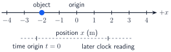
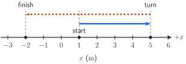
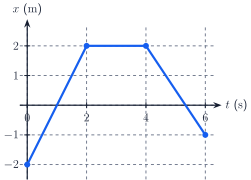
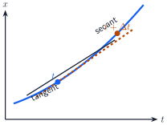
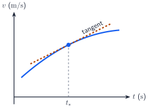
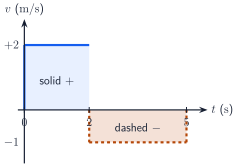
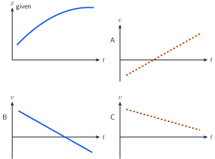
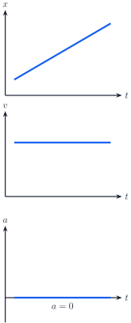
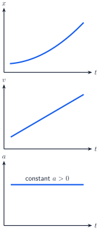
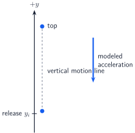

+++
order = 3
subject = "physics"
tags = ["mechanics", "physics", "kinematics", "one-dimensional-motion"]
prerequisites = ["chapter:01_foundations", "concept:vector-components"]
provides = ["one-dimensional-motion", "kinematic-graphs", "constant-acceleration", "near-earth-free-fall"]
+++

# One-dimensional kinematics

<!-- card-id: 68a3cff5-ae10-499d-91bd-16c91544da94 -->
Q: **Motion** means change of position over time. To describe motion along one straight line, choose a coordinate axis with a spatial origin \(x=0\), a positive direction, and a time origin \(t=0\). The **position** \(x(t)\) is the object's signed coordinate at clock reading \(t\).

What is the object's position in the shown coordinate system, and what does its sign mean?
A: \(x=-2\ \mathrm{m}\). The negative sign means the object is \(2\ \mathrm{m}\) from the spatial origin on the side opposite the chosen positive direction; it does not mean a negative distance traveled.

<!-- card-id: b730a3e9-2bbf-4445-945f-49c8d20b5c51 -->
Q: Clock readings depend on the chosen time origin. For an initial event at \(t_i\) and a later final event at \(t_f\), **elapsed time** is \(\Delta t=t_f-t_i>0\). If the time origin is shifted so both clock readings increase by \(5\ \mathrm{s}\), what happens to \(\Delta t\)?
A: It is unchanged: \((t_f+5\ \mathrm{s})-(t_i+5\ \mathrm{s})=t_f-t_i\). A clock reading and an elapsed time are different quantities.

<!-- card-id: ae6e8c8f-c77f-4acb-8b61-45b6c37974ee -->
Q: **Displacement** over an interval is the signed change in position,
\(\Delta x=x_f-x_i\). An object moves from \(x_i=-3\ \mathrm{m}\) to
\(x_f=2\ \mathrm{m}\). What is its displacement?
A: \(\Delta x=2-(-3)=+5\ \mathrm{m}\). The positive sign gives the displacement direction along the chosen axis.

<!-- card-id: 3091cea2-831f-4e27-a53b-a7890ce06c9f -->
Q: **Distance traveled** is the total nonnegative path length. It accumulates each part of a trip, while displacement uses only the initial and final positions.

For the shown trip from \(x=1\ \mathrm{m}\) to \(x=5\ \mathrm{m}\) and then to \(x=-2\ \mathrm{m}\), what are the distance traveled and displacement?
A: Distance \(=|5-1|+|-2-5|=11\ \mathrm{m}\). Displacement \(=-2-1=-3\ \mathrm{m}\).

<!-- card-id: 8634bc2c-98d9-4ad2-ad53-7ef78269a965 -->
Q: If a coordinate origin is shifted but the positive direction is unchanged, what happens to position, displacement, and distance traveled? What changes if the axis direction is reversed instead?
A: Shifting the origin changes position coordinates but not displacement or distance. Reversing the axis changes the signs of position and displacement, while distance remains unchanged.

<!-- card-id: b186f464-673b-4d3c-bfab-6d3888ec2c90 -->
Q: **Average velocity** is signed displacement per elapsed time:
\[
\bar v=\frac{\Delta x}{\Delta t}.
\]
An object goes from \(x=-3\ \mathrm{m}\) at \(t=1\ \mathrm{s}\) to \(x=5\ \mathrm{m}\) at \(t=5\ \mathrm{s}\). What is its average velocity?
A: \(\bar v=(5-(-3))/(5-1)=+2\ \mathrm{m/s}\). Its sign gives the direction of the net position change.

<!-- card-id: bd3cf925-0733-40b1-b600-3e75609dd434 -->
Q: **Average speed** is total distance traveled divided by elapsed time. What decisive feature distinguishes it from the magnitude of average velocity?
A: Average speed uses the entire path length; \(|\bar v|\) uses only \(|\Delta x|\). They are equal only when no part of the motion reverses direction along the line.

<!-- card-id: e44c2334-0e0a-4d31-acd9-ed5cb1eb3903 -->
P: An object travels from \(x=0\) to \(x=12\ \mathrm{m}\), then back to \(x=4\ \mathrm{m}\), in a total elapsed time of \(10\ \mathrm{s}\). Find its average velocity and average speed.
S: **IDENTIFY:** Average velocity uses displacement; average speed uses total path length.

**PLAN:** Compute \(\Delta x=4-0\) and distance \(=12+8\), then divide each by \(10\ \mathrm{s}\).

**EXECUTE:** \(\bar v=4/10=+0.40\ \mathrm{m/s}\). Average speed \(=20/10=2.0\ \mathrm{m/s}\).

**EVALUATE:** The speed is larger because the return segment adds distance but partly cancels displacement.

<!-- card-id: 2415fdb1-3bc7-4f4a-8fc3-faa14c040a72 -->
Q: A **position–time graph** plots clock reading \(t\) horizontally and signed position \(x(t)\) vertically. Each point tells where the object is at one time.

Why should the drawn line not be read as the object's spatial path?
A: Its horizontal direction represents time, not another spatial direction. The object moves only along the one-dimensional \(x\)-axis; the graph records how its coordinate changes with time.

<!-- card-id: 99447c89-e441-4181-9b35-1566537dea50 -->
Q: On a position–time graph, the slope of the secant line between two points is
\(\Delta x/\Delta t\), the average velocity over that interval. What is the average velocity from \(t=0\) to \(t=2\ \mathrm{s}\) in the graph?

A: \((2-(-2))/(2-0)=+2\ \mathrm{m/s}\). The upward slope corresponds to positive average velocity.

<!-- card-id: 3b19ebba-3c77-4b2c-a03c-b7e50694e72b -->
Q: In the same position–time graph, what does each segment from \(2\) to \(4\ \mathrm{s}\) and from \(4\) to \(6\ \mathrm{s}\) say about the motion?

A: From \(2\) to \(4\ \mathrm{s}\), position is constant, so velocity is zero. From \(4\) to \(6\ \mathrm{s}\), position decreases, so velocity is negative.

<!-- card-id: ec51b1ac-a8cd-4544-a12c-fac1cfe044bb -->
P: Use the position–time graph over \(0\le t\le6\ \mathrm{s}\). Find the displacement, distance traveled, and average velocity for the full interval.

S: **IDENTIFY:** Read successive positions \(-2,\ 2,\ 2,\ -1\ \mathrm{m}\).

**PLAN:** Endpoint subtraction gives displacement; absolute changes give distance; displacement divided by \(6\ \mathrm{s}\) gives average velocity.

**EXECUTE:** \(\Delta x=-1-(-2)=+1\ \mathrm{m}\). Distance \(=|2-(-2)|+|2-2|+|-1-2|=7\ \mathrm{m}\). Thus \(\bar v=1/6\ \mathrm{m/s}\).

**EVALUATE:** Distance exceeds \(|\Delta x|\) because the graph reverses from increasing to decreasing position.

<!-- card-id: 795e0e5f-65dd-42a1-8946-93eb9699d0b3 -->
Q: Average velocity over \(t\) to \(t+\Delta t\) is
\(\Delta x/\Delta t\). As \(\Delta t\) shrinks toward zero, these secant slopes approach the **instantaneous velocity**
\[
v(t)=\lim_{\Delta t\to0}\frac{x(t+\Delta t)-x(t)}{\Delta t}
=\frac{dx}{dt}.
\]

What geometric quantity on the graph represents \(v(t)\)?
A: The slope of the tangent line to \(x(t)\) at that instant. Its units are position units divided by time units, such as \(\mathrm{m/s}\).

<!-- card-id: 6d664d06-8155-4785-83f8-56f22df14093 -->
P: A position model is \(x(t)=(1+4t-t^2)\ \mathrm{m}\), with \(t\) in seconds. Find the instantaneous velocity at \(t=1\ \mathrm{s}\).
S: **IDENTIFY:** Instantaneous velocity is the derivative of position.

**PLAN:** Differentiate \(x(t)\), then evaluate at \(t=1\ \mathrm{s}\).

**EXECUTE:** \(v(t)=dx/dt=(4-2t)\ \mathrm{m/s}\), so \(v(1\ \mathrm{s})=+2\ \mathrm{m/s}\).

**EVALUATE:** The positive result means position is increasing at that instant; the units are \(L/T\).

<!-- card-id: 7e790cf7-054a-4e7d-b80c-4e23c55e63d0 -->
Q: **Instantaneous speed** is the magnitude of instantaneous velocity, \(|v|\). If \(v=-3\ \mathrm{m/s}\), what are the speed and direction of motion?
A: Speed \(=3\ \mathrm{m/s}\); motion is in the negative coordinate direction. Speed is nonnegative and discards direction.

<!-- card-id: f697ffbc-5d4f-49bc-a2d6-0c76e4995b7c -->
Q: A one-dimensional **turning point** is an instant when the direction of motion reverses. For differentiable \(x(t)\), what must happen to \(v\) there, and why is \(v=0\) alone not sufficient evidence of a turn?
A: Velocity must pass through \(0\) and change sign. An object can have \(v=0\) at one instant and then continue in the same direction, so the sign change establishes reversal.

<!-- card-id: 7053c9f2-0646-4243-a3d3-599d23256551 -->
Q: **Average acceleration** is signed velocity change per elapsed time:
\[
\bar a=\frac{\Delta v}{\Delta t}=\frac{v_f-v_i}{t_f-t_i}.
\]
Velocity changes from \(+2\ \mathrm{m/s}\) to \(-4\ \mathrm{m/s}\) in \(3\ \mathrm{s}\). What is \(\bar a\), and what does its unit mean?
A: \(\bar a=(-4-2)/3=-2\ \mathrm{m/s^2}\). Each second, velocity changes by \(-2\ \mathrm{m/s}\) on average.

<!-- card-id: 8428a38f-81b7-40d6-b9c0-8e6c83dadf88 -->
Q: Shrinking the acceleration interval gives
\[
a(t)=\lim_{\Delta t\to0}\frac{v(t+\Delta t)-v(t)}{\Delta t}
=\frac{dv}{dt}=\frac{d^2x}{dt^2}.
\]

What does the tangent slope on this velocity–time graph represent?
A: Instantaneous acceleration at that time. The second derivative notation means position is differentiated once to get velocity and again to get acceleration.

<!-- card-id: 8bc01de7-76e5-4f4e-9192-5914ac201dbb -->
P: A velocity model is \(v(t)=(6-2t)\ \mathrm{m/s}\), with \(t\) in seconds. Find the instantaneous acceleration.
S: **IDENTIFY:** Acceleration is \(dv/dt\).

**PLAN:** Differentiate the velocity with respect to time.

**EXECUTE:** \(a=dv/dt=-2\ \mathrm{m/s^2}\).

**EVALUATE:** The constant negative derivative means velocity decreases by \(2\ \mathrm{m/s}\) each second, matching the expression's slope.

<!-- card-id: c5f080cf-66d9-4180-87c0-8538c844453d -->
Q: In one dimension, how do the signs of velocity and acceleration determine whether speed is increasing or decreasing?
A: Same signs mean speed increases; opposite signs mean speed decreases. Acceleration describes velocity change, so “negative acceleration” does not by itself mean “slowing down.”

<!-- card-id: 8a446a9a-f7ce-47a6-a38f-7e7f9cd75962 -->
Q: At an instant when \(v=0\), what can and cannot be concluded about acceleration?
A: Nothing definite follows about acceleration: it may be positive, negative, or zero. Nonzero acceleration at \(v=0\) changes the velocity through zero; a turning point additionally requires a velocity sign change.

<!-- card-id: c50c22e6-8423-4c56-8e86-db0575e9ee8e -->
Q: A velocity–time graph plots \(v(t)\) vertically and \(t\) horizontally. What do the graph's vertical value and tangent slope represent at one instant?

A: The vertical value is instantaneous velocity; the tangent slope is instantaneous acceleration. Reading the height and calculating the slope are different operations.

<!-- card-id: d2056811-74d8-49dd-94b5-6dda96905aae -->
Q: Over a short interval with nearly constant velocity, displacement is approximately \(v\,\Delta t\), the signed area of a thin rectangle on a velocity–time graph. Summing and shrinking the intervals gives
\[
\Delta x=\int_{t_i}^{t_f}v(t)\,dt.
\]

Why does area below the time axis contribute negative displacement?
A: There \(v<0\), while \(\Delta t>0\), so each contribution \(v\,\Delta t\) is negative. The signed integral preserves direction.

<!-- card-id: 774803df-6d0b-4769-97bb-aaaae83e82e2 -->
P: In the velocity–time graph, \(v=+2\ \mathrm{m/s}\) from \(0\) to \(2\ \mathrm{s}\), then \(v=-1\ \mathrm{m/s}\) from \(2\) to \(5\ \mathrm{s}\). Find the displacement.

S: **IDENTIFY:** Displacement is signed area under \(v(t)\).

**PLAN:** Add the positive and negative rectangle areas.

**EXECUTE:** \(\Delta x=(2)(2)+(-1)(3)=+1\ \mathrm{m}\).

**EVALUATE:** Units are \((\mathrm{m/s})(\mathrm{s})=\mathrm{m}\), and the small positive result reflects partial cancellation.

<!-- card-id: c3530ae2-610e-425c-8dea-805c8d43df27 -->
Q: For the same velocity–time graph, what distance is traveled from \(0\) to \(5\ \mathrm{s}\)?

A: \(4+3=7\ \mathrm{m}\). Distance is the area under speed \(|v|\), so negative-velocity regions contribute positive path length rather than canceling.

<!-- card-id: 95c0bbcb-ae76-49c5-a119-a2b2d46b705f -->
Q: On an acceleration–time graph, the vertical value is acceleration. Since \(\Delta v\approx a\,\Delta t\) over a short interval, the signed area gives
\[
\Delta v=\int_{t_i}^{t_f}a(t)\,dt.
\]

What are the units of this signed area?
A: \((\mathrm{m/s^2})(\mathrm{s})=\mathrm{m/s}\), the units of velocity change.

<!-- card-id: a10f03ac-3c26-427f-8cb9-db94ab3225ac -->
P: In the acceleration–time graph, \(a=+2\ \mathrm{m/s^2}\) from \(0\) to \(2\ \mathrm{s}\), then \(a=-1\ \mathrm{m/s^2}\) from \(2\) to \(5\ \mathrm{s}\). If \(v_i=-2\ \mathrm{m/s}\), find \(v_f\).

S: **IDENTIFY:** Signed area gives velocity change.

**PLAN:** Compute \(\Delta v=(2)(2)+(-1)(3)\), then use \(v_f=v_i+\Delta v\).

**EXECUTE:** \(\Delta v=+1\ \mathrm{m/s}\), so \(v_f=-2+1=-1\ \mathrm{m/s}\).

**EVALUATE:** The net positive area makes velocity more positive, though the final velocity remains negative.

<!-- card-id: 5143704d-cce3-42dd-a760-afd510feac05 -->
Q: Match each retrieval operation to its result: slope of \(x(t)\), slope of \(v(t)\), signed area under \(v(t)\), and signed area under \(a(t)\).
A: They give, respectively, velocity, acceleration, displacement, and velocity change. A graph's vertical value, slope, and area answer different questions.

<!-- card-id: d969405c-8eb5-4644-9b43-5743441b2229 -->
Q: A graph is **concave down** when its tangent slope decreases as time increases. The top panel shows such a smooth position–time graph. Which candidate velocity graph, A, B, or C, is consistent with its tangent slopes?

A: B. The position slope decreases from positive through zero to negative, so velocity must decrease through zero; A has the wrong trend and C never becomes negative.

<!-- card-id: c88a1378-60eb-47f0-848b-135d5c53b9b9 -->
P: A velocity–time graph is a straight line that rises from \(-4\ \mathrm{m/s}\) at \(t=0\) to \(+4\ \mathrm{m/s}\) at \(t=4\ \mathrm{s}\). A graph is **concave up** when its tangent slope increases as time increases. Without choosing a position origin, describe the corresponding acceleration–time graph and the qualitative shape of the position–time graph.
S: **IDENTIFY:** Acceleration is the slope of \(v(t)\); velocity is the slope of \(x(t)\).

**PLAN:** Find the constant velocity slope, then translate the changing sign of velocity into the position trend.

**EXECUTE:** \(a=(4-(-4))/4=+2\ \mathrm{m/s^2}\), so \(a(t)\) is a horizontal line at \(+2\). Position decreases at first, has a smooth minimum when \(v=0\) at \(2\ \mathrm{s}\), then increases; its graph is concave up.

**EVALUATE:** A positive constant acceleration requires a velocity line with positive slope, matching the given graph.

<!-- card-id: 078d47f5-ee33-442b-a9a8-79b3c42dc1e1 -->
Q: A **constant-velocity model** assumes the same signed velocity throughout a stated interval, so \(x_f=x_i+v\Delta t\). What three graph signatures follow?

A: \(x_f=x_i+v\Delta t\). The position graph is a straight line of slope \(v\), the velocity graph is horizontal, and the acceleration graph is zero.

<!-- card-id: 35588433-2056-4da0-8f7d-df89ec615f56 -->
P: A marker follows a constant-velocity model with \(x_i=-5\ \mathrm{m}\) at \(t_i=2\ \mathrm{s}\) and \(v=+3\ \mathrm{m/s}\). Find its position at \(t_f=6\ \mathrm{s}\).
S: **IDENTIFY:** Constant velocity makes displacement \(v\Delta t\).

**PLAN:** Compute elapsed time, then add displacement to the initial position.

**EXECUTE:** \(\Delta t=4\ \mathrm{s}\), so \(x_f=-5+(3)(4)=+7\ \mathrm{m}\).

**EVALUATE:** The \(+12\ \mathrm{m}\) displacement from \(-5\ \mathrm{m}\) ends at \(+7\ \mathrm{m}\); units reduce to metres.

<!-- card-id: 00c6cfa3-bf23-4a5d-bf12-26cecaff71bb -->
Q: A **constant-acceleration model** assumes the same signed acceleration throughout a stated interval.

What graph signatures distinguish it from constant velocity?
A: Acceleration is a horizontal nonzero line, velocity is linear in time, and position is quadratic (curved). Constant velocity instead has zero acceleration and a linear position graph.

<!-- card-id: 94f7465f-5cbc-4d0d-b7ba-059319a4be69 -->
Q: Starting from \(\bar a=\Delta v/\Delta t\), why does constant acceleration imply
\[
v_f=v_i+a\Delta t?
\]
A: With constant \(a\), instantaneous and average acceleration over the interval are the same. Thus \(a=(v_f-v_i)/\Delta t\), and rearranging gives the equation.

<!-- card-id: d7bda785-e280-462c-80c8-7950269e5558 -->
Q: For constant acceleration, the velocity–time graph is a straight line from \(v_i\) to \(v_f\). How does its area give
\[
\Delta x=\frac{v_i+v_f}{2}\Delta t?
\]
A: The area is a trapezoid whose average height is \((v_i+v_f)/2\) and width is \(\Delta t\). Equivalently, the average velocity is the arithmetic mean of the endpoint velocities only because \(v(t)\) is linear.

<!-- card-id: e6bb966a-ce90-4c7d-bb24-d0244c478eec -->
Q: Use \(v_f=v_i+a\Delta t\) in
\(\Delta x=((v_i+v_f)/2)\Delta t\). What constant-acceleration position relation follows?
A: \[
\Delta x=v_i\Delta t+\frac12a(\Delta t)^2.
\]
It follows by substitution and applies only over an interval where \(a\) is constant.

<!-- card-id: f2245f18-bc0f-4625-bc3b-833529fad089 -->
Q: Eliminate \(\Delta t\) between
\(v_f=v_i+a\Delta t\) and
\(\Delta x=((v_i+v_f)/2)\Delta t\). What no-time relation results?
A: \[
v_f^2=v_i^2+2a\Delta x.
\]
Using \(\Delta t=(v_f-v_i)/a\) gives \(2a\Delta x=(v_i+v_f)(v_f-v_i)=v_f^2-v_i^2\); the \(a=0\) case is already the constant-velocity model.

<!-- card-id: f8246a13-2db6-40ad-9692-e3a70b31ecdb -->
Q: A measured velocity–time graph is noticeably curved over the interval. Why is using one set of constant-acceleration equations across the whole interval not justified merely because an average acceleration can be calculated?
A: A curved \(v(t)\) has changing slope, so acceleration is not constant. An average acceleration describes only the net velocity change; use the actual function/graph or shorter intervals where a constant-\(a\) approximation is adequate.

<!-- card-id: 28c23d43-913a-4bc7-807b-ae214c39aa21 -->
Q: Under a verified constant-acceleration model, \(v_i\), \(a\), and \(\Delta x\) are known; \(v_f\) is wanted and time is neither known nor wanted. Which relation is the direct choice, and why?
A: Use \(v_f^2=v_i^2+2a\Delta x\), because it contains the wanted quantity and all three known quantities but omits \(\Delta t\). First check constant acceleration, then choose by knowns and unknowns.

<!-- card-id: 848d3326-6242-45e3-ad22-a8fa1de71cbf -->
P: A marker has \(v_i=+2.0\ \mathrm{m/s}\) and constant \(a=+3.0\ \mathrm{m/s^2}\) for \(\Delta t=4.0\ \mathrm{s}\). Find \(v_f\) and \(\Delta x\).
S: **IDENTIFY:** Constant acceleration is stated; \(v_i,a,\Delta t\) are known.

**PLAN:** Use \(v_f=v_i+a\Delta t\) and \(\Delta x=v_i\Delta t+\tfrac12a(\Delta t)^2\).

**EXECUTE:** \(v_f=2.0+(3.0)(4.0)=14\ \mathrm{m/s}\). \(\Delta x=(2.0)(4.0)+\tfrac12(3.0)(4.0)^2=32\ \mathrm{m}\).

**EVALUATE:** Dimensions are \(L/T\) and \(L\); positive \(v\) and \(a\) agree with increasing speed and positive displacement.

<!-- card-id: 33f757f6-42d2-4bd8-a3b5-f4f97f2f7968 -->
P: A marker changes from \(v_i=+12\ \mathrm{m/s}\) to \(v_f=0\) under constant \(a=-3.0\ \mathrm{m/s^2}\). Time is not requested. Choose the direct relation and find \(\Delta x\).
S: **IDENTIFY:** Known \(v_i,v_f,a\), unknown \(\Delta x\); constant acceleration is stated.

**PLAN:** Use the no-time relation and solve for displacement.

**EXECUTE:** \(\Delta x=(v_f^2-v_i^2)/(2a)=(0-144)/(2(-3.0))=+24\ \mathrm{m}\).

**EVALUATE:** Negative acceleration reduces a positive velocity to zero while the object still moves \(24\ \mathrm{m}\) in the positive direction.

<!-- card-id: 49cf288e-bdbc-48b8-87fa-615e10ef86f2 -->
P: Starting from rest, a marker undergoes constant \(a=+2.0\ \mathrm{m/s^2}\) and displacement \(\Delta x=+25\ \mathrm{m}\). Independently find the elapsed time.
S: **IDENTIFY:** \(v_i=0\), \(a\), and \(\Delta x\) are known; \(\Delta t\) is wanted.

**PLAN:** Use \(\Delta x=v_i\Delta t+\tfrac12a(\Delta t)^2\).

**EXECUTE:** \(25=\tfrac12(2.0)(\Delta t)^2\), so \(\Delta t=\sqrt{25}=5.0\ \mathrm{s}\). The algebraic negative root is rejected because elapsed time is positive.

**EVALUATE:** Substitution gives \((1.0\ \mathrm{m/s^2})(25\ \mathrm{s^2})=25\ \mathrm{m}\).

<!-- card-id: 21684772-fc6a-4ea7-937e-b040decf1d18 -->
P: During three consecutive \(1\ \mathrm{s}\) intervals, an object's position increases by \(3\ \mathrm{m}\) in each interval. Which simpler model is supported over those intervals—constant velocity or nonzero constant acceleration—and what observation is decisive?
S: **IDENTIFY:** Compare equal-time position changes with the graph signatures of the two models.

**PLAN:** Equal displacement in every equal time interval means equal average velocity on each interval.

**EXECUTE:** Constant velocity, \(v=+3\ \mathrm{m/s}\), is supported. Nonzero constant acceleration would make the equal-time displacement increments change.

**EVALUATE:** The conclusion is limited to the observed intervals; it does not prove velocity stays constant outside them.

<!-- card-id: 72f7ac11-3a90-4628-a1f2-10a5bdcad49f -->
Q: **Near-Earth free fall** is a vertical-motion model in which Earth's gravity is the only retained influence. Over a modest height range, while **air effects**—changes caused by the surrounding air—are negligible, acceleration is approximated as constant downward with magnitude \(g\approx9.8\ \mathrm{m/s^2}\).

If \(+y\) is upward, what algebraic acceleration belongs in the constant-acceleration equations?
A: \(a_y=-g\approx-9.8\ \mathrm{m/s^2}\), because the modeled acceleration points opposite \(+y\). The approximation can fail when air effects or variation of \(g\) matter, or after contact.

<!-- card-id: b2a9b62f-9252-48f6-94f4-52e952a42807 -->
Q: In the upward-positive free-fall setup, **dropped** means released with \(v_i=0\), while **thrown upward** means \(v_i>0\). At the smooth top turning point of an upward throw, what are the velocity and acceleration?

A: \(v=0\) at the instant of the turn, but \(a=-g\), not zero. The negative acceleration makes velocity change from positive before the top to negative after it.

<!-- card-id: 8df25559-31a6-4a99-afbb-789d3fd42530 -->
P: An object is dropped from rest \(19.6\ \mathrm{m}\) above the ground. Use \(+y\) upward, neglect air effects, and take \(g=9.8\ \mathrm{m/s^2}\). Find the elapsed time to reach the ground.
S: **IDENTIFY:** This is near-Earth free fall with constant \(a=-9.8\ \mathrm{m/s^2}\), \(v_i=0\), and \(\Delta y=-19.6\ \mathrm{m}\).

**PLAN:** Use \(\Delta y=v_i\Delta t+\tfrac12a(\Delta t)^2\).

**EXECUTE:** \(-19.6=\tfrac12(-9.8)(\Delta t)^2\), so \((\Delta t)^2=4.00\ \mathrm{s^2}\) and \(\Delta t=2.00\ \mathrm{s}\).

**EVALUATE:** Elapsed time is the positive root; substitution returns the stated downward displacement.

<!-- card-id: 298ff856-4d16-4886-82ff-be747ab82985 -->
P: An object is thrown upward with \(v_i=+19.6\ \mathrm{m/s}\). With \(+y\) upward, \(a=-9.8\ \mathrm{m/s^2}\), and negligible air effects, complete the plan \(v_f=v_i+a\Delta t\) to find the time to the top.
S: **IDENTIFY:** At the top turning point, \(v_f=0\).

**PLAN:** Substitute \(v_f=0\), \(v_i=+19.6\ \mathrm{m/s}\), and \(a=-9.8\ \mathrm{m/s^2}\).

**EXECUTE:** \(0=19.6-9.8\Delta t\), so \(\Delta t=2.00\ \mathrm{s}\).

**EVALUATE:** The negative acceleration changes velocity by \(-19.6\ \mathrm{m/s}\), exactly enough to reach zero.

<!-- card-id: 9b4ee184-fbaa-430f-a8fe-b1d6bde3b016 -->
P: An object is dropped from rest through \(\Delta y=-44.1\ \mathrm{m}\). Use \(+y\) upward, constant \(a=-9.8\ \mathrm{m/s^2}\), and negligible air effects. Independently find its velocity just before the endpoint.
S: **IDENTIFY:** \(v_i=0\), \(a\), and \(\Delta y\) are known; time is not needed.

**PLAN:** Use \(v_f^2=v_i^2+2a\Delta y\), then choose the sign from the motion direction.

**EXECUTE:** \(v_f^2=2(-9.8)(-44.1)=864.36\ \mathrm{m^2/s^2}\), so \(|v_f|=29.4\ \mathrm{m/s}\). Downward motion gives \(v_f=-29.4\ \mathrm{m/s}\).

**EVALUATE:** The square equation supplies a magnitude; the upward-positive coordinate convention supplies the negative sign.

<!-- card-id: 9319b4d2-cfb7-45da-ba62-2bb6d4f4b78a -->
Q: An object is thrown upward and follows the chapter's near-Earth free-fall model until it returns to its release height. Which qualitative graph family is consistent: position concave down with a smooth maximum, velocity a descending straight line through zero, and acceleration a horizontal line at \(-g\); or the same position graph with acceleration zero at the top?
A: The first family is consistent. Constant negative acceleration makes velocity decrease linearly through zero and position remain concave down; acceleration does not vanish at the turning point.
